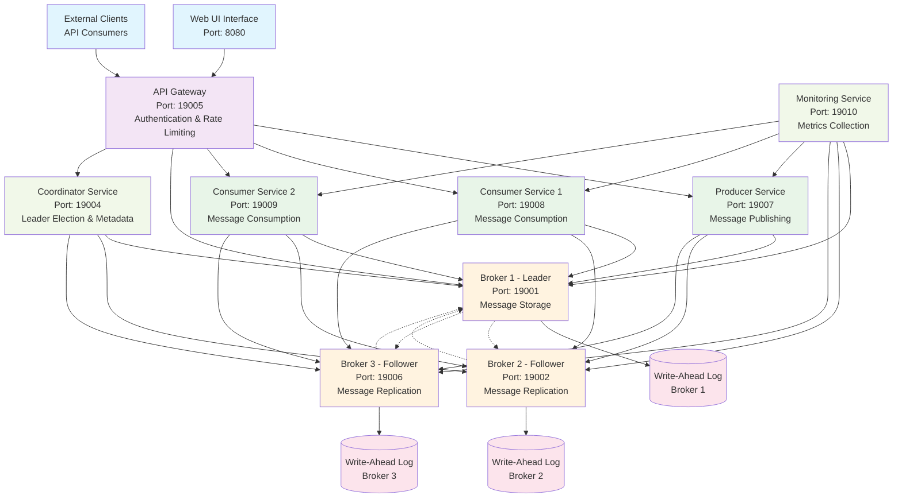
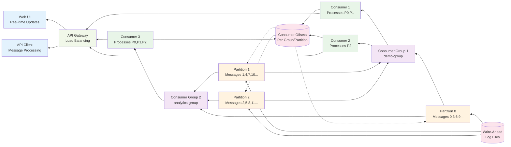
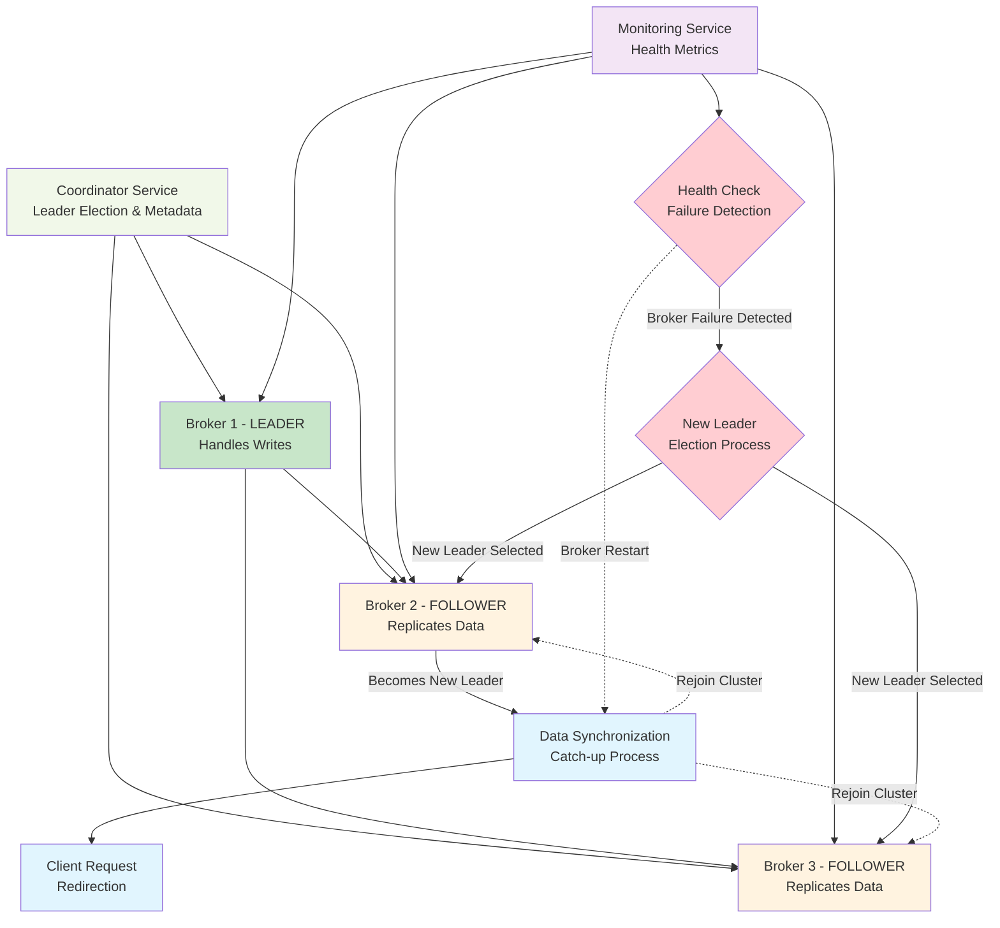
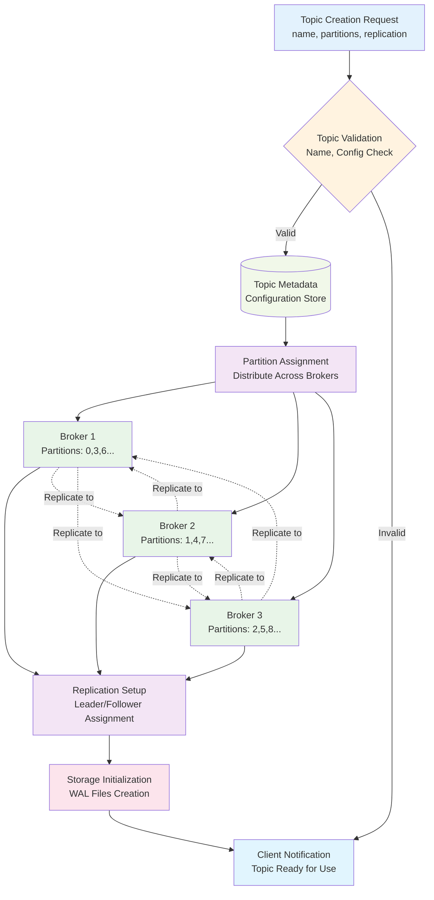
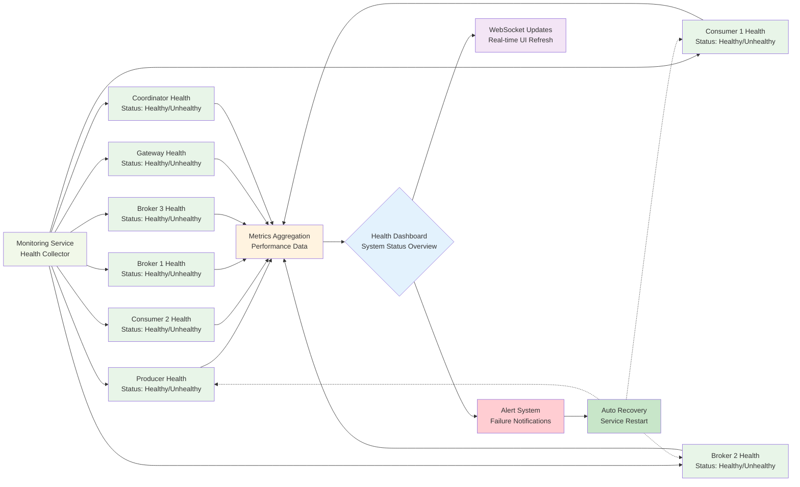

# Distributed Message Queue System - Data Flow Diagrams

## System Architecture Overview



## Message Production Flow

```mermaid
flowchart LR
    %% Input Sources
    WebUI[Web UI<br/>User Input]
    APIClient[API Client<br/>External System]
    
    %% Processing Pipeline
    Gateway[API Gateway<br/>Auth + Rate Limit]
    Producer[Producer Service<br/>Message Processing]
    
    %% Partitioning Logic
    Partitioner{Partition Logic<br/>Hash(key) % partitions}
    
    %% Broker Cluster
    P0[Partition 0<br/>Broker 1]
    P1[Partition 1<br/>Broker 2]
    P2[Partition 2<br/>Broker 3]
    
    %% Replication
    R0A[Replica 0A<br/>Broker 2]
    R0B[Replica 0B<br/>Broker 3]
    R1A[Replica 1A<br/>Broker 1]
    R1B[Replica 1B<br/>Broker 3]
    R2A[Replica 2A<br/>Broker 1]
    R2B[Replica 2B<br/>Broker 2]
    
    %% Storage
    WAL[(Write-Ahead<br/>Log Files)]
    
    %% Flow Connections
    WebUI --> Gateway
    APIClient --> Gateway
    Gateway --> Producer
    Producer --> Partitioner
    
    Partitioner -->|key hash % 3 = 0| P0
    Partitioner -->|key hash % 3 = 1| P1
    Partitioner -->|key hash % 3 = 2| P2
    
    P0 --> R0A
    P0 --> R0B
    P1 --> R1A
    P1 --> R1B
    P2 --> R2A
    P2 --> R2B
    
    P0 --> WAL
    P1 --> WAL
    P2 --> WAL
    R0A --> WAL
    R0B --> WAL
    R1A --> WAL
    R1B --> WAL
    R2A --> WAL
    R2B --> WAL
    
    %% Styling
    classDef input fill:#e3f2fd
    classDef process fill:#e8f5e8
    classDef partition fill:#fff3e0
    classDef replica fill:#f3e5f5
    classDef storage fill:#fce4ec
    
    class WebUI,APIClient input
    class Gateway,Producer,Partitioner process
    class P0,P1,P2 partition
    class R0A,R0B,R1A,R1B,R2A,R2B replica
    class WAL storage
```

## Message Consumption Flow



## Replication and Fault Tolerance Flow



## Topic and Partition Management Flow



## Monitoring and Health Check Flow



## Key Data Flow Characteristics

### 1. **High Availability**
- 3-broker cluster with replication factor of 3
- Leader-follower replication pattern
- Automatic failover and recovery

### 2. **Load Distribution**
- Round-robin partition assignment
- Consumer group load balancing
- Gateway-based request distribution

### 3. **Data Persistence**
- Write-Ahead Logging (WAL) for durability
- Partition-based message storage
- Offset tracking for consumption resumption

### 4. **Fault Tolerance**
- Health monitoring with automatic recovery
- Leader election for broker failures
- Client request redirection during failures

### 5. **Scalability**
- Horizontal scaling through partition addition
- Multiple consumer instances per group
- Load balancing across broker instances