# Google Drive MVP System - Data Flow Documentation

This document provides a comprehensive overview of all features and their data flows in the Google Drive-like MVP system.

## System Architecture Overview

The system consists of 6 microservices:
- **Auth Service** (Port 9011): User authentication and authorization
- **File Service** (Port 9012): File storage and retrieval
- **Metadata Service** (Port 9003): File metadata and folder management
- **Block Service** (Port 9004): Block-based file storage for large files
- **Notification Service** (Port 9005): Real-time notifications and messaging
- **API Gateway** (Port 9010): Request routing, load balancing, and authentication middleware
- **UI Service** (Port 3000): React frontend application

## Infrastructure Services
- **PostgreSQL** (Port 5432): Primary database
- **Redis** (Port 6379): Caching and rate limiting
- **MinIO** (Port 9000): Object storage

---

## Core Features and Data Flows

### 1. User Authentication & Authorization

#### User Registration Flow

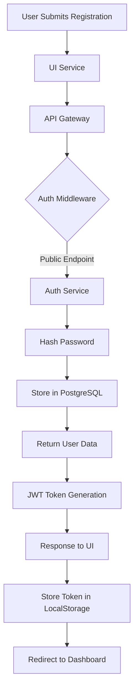

**Data Flow:**
1. User fills registration form (email, username, password)
2. UI Service sends POST request to `/auth/register` via API Gateway
3. API Gateway routes to Auth Service (bypasses auth middleware for public endpoint)
4. Auth Service validates email uniqueness, hashes password with bcrypt
5. User data stored in PostgreSQL with auto-generated UUID
6. JWT token created with user_id and expiration
7. Response includes user data and token
8. UI stores token in localStorage and redirects to dashboard

#### User Login Flow

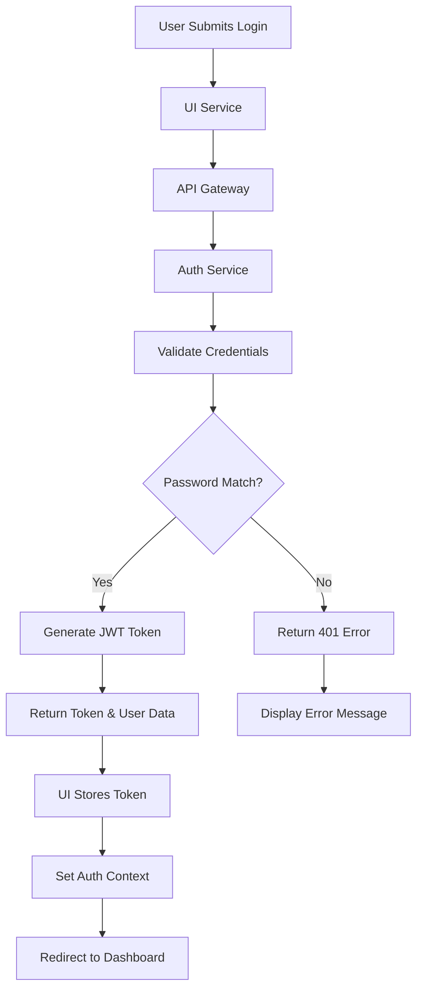

#### Token Verification Flow

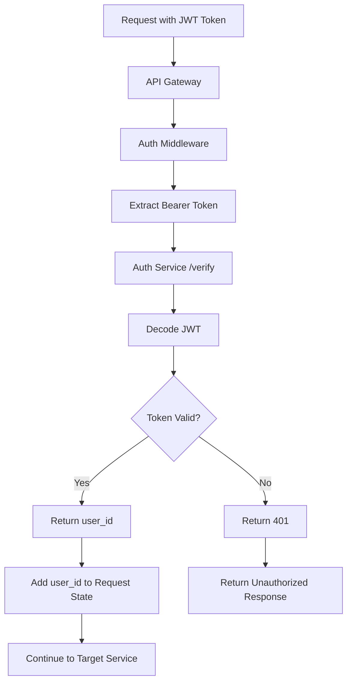

### 2. File Management System

#### File Upload Flow

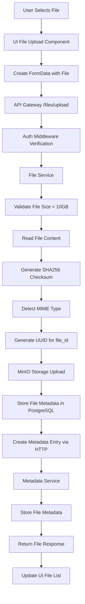

**Key Data Points:**
- File metadata: `file_id`, `filename`, `size`, `content_type`, `checksum`, `upload_date`
- Storage path: `{user_id}/{file_id}`
- Maximum file size: 10GB

#### File Download Flow

```mermaid
flowchart TD
    A[User Clicks Download] --> B[UI Service]
    B --> C[API Gateway /files/download/{file_id}]
    C --> D[Auth Middleware]
    D --> E[File Service]
    E --> F[Query File from PostgreSQL]
    F --> G{File Exists & User Owns?}
    G -->|Yes| H[Get Storage Path]
    G -->|No| I[Return 404/403]
    H --> J[Download from MinIO]
    J --> K[Stream Response]
    K --> L[Browser Download]
```

#### File Listing Flow

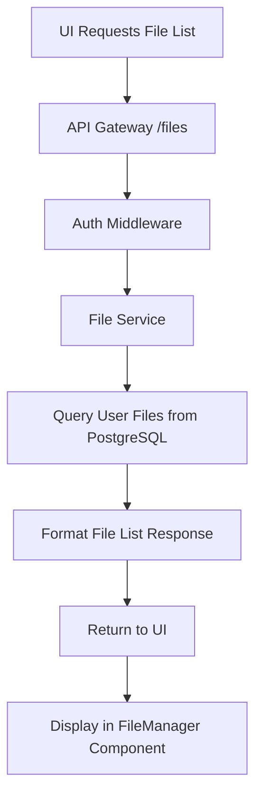

### 3. Metadata Management System

#### Metadata Creation Flow

```mermaid
flowchart TD
    A[File Upload Triggers] --> B[File Service]
    B --> C[HTTP POST to Metadata Service]
    C --> D[/metadata/metadata endpoint]
    D --> E[Auth Token Verification]
    E --> F[Store in PostgreSQL]
    F --> G[Include: file_id, filename, size, type]
    G --> H[Add timestamps and user_id]
    H --> I[Return Metadata ID]
```

#### File Search Flow

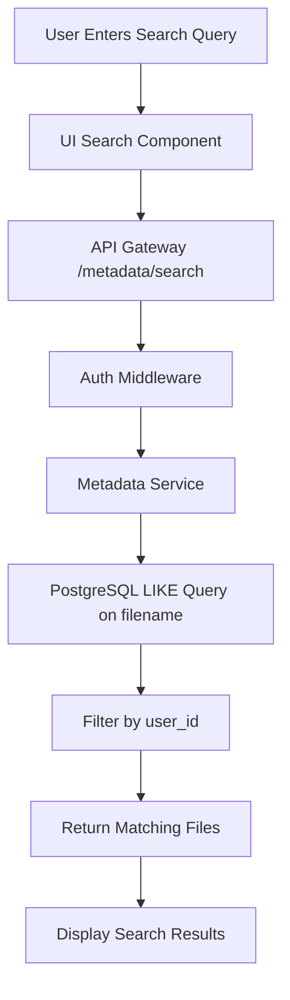

#### Folder Management Flow

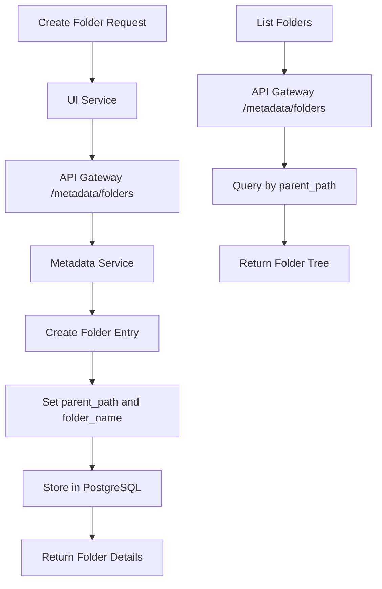

### 4. Block-Based Storage System

#### Block Upload Flow (Large Files)

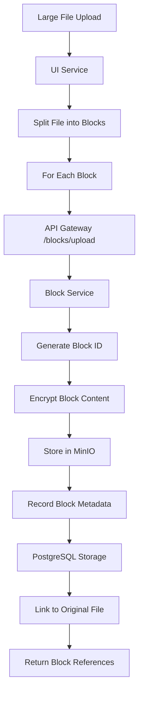

#### Block Retrieval Flow

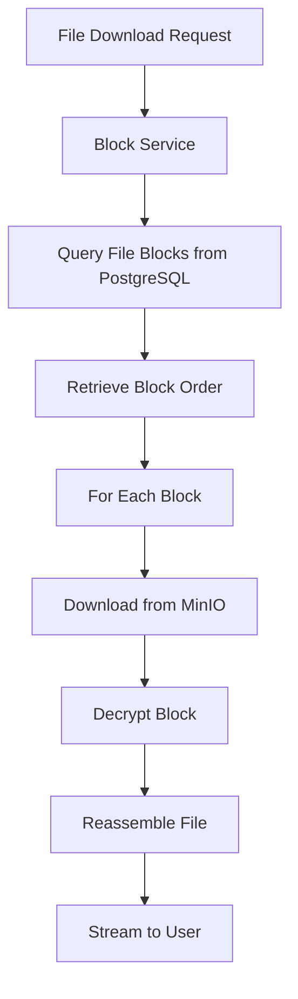

### 5. Real-time Notification System

#### Send Notification Flow

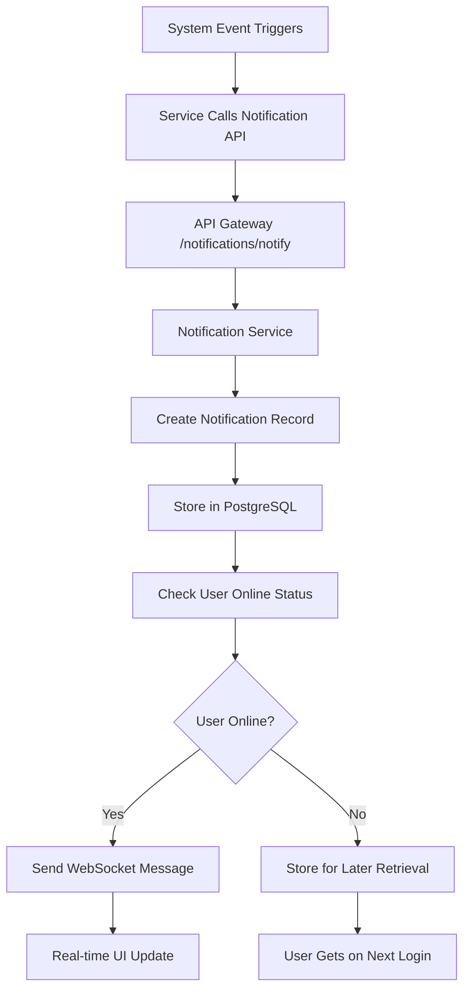

#### WebSocket Connection Flow

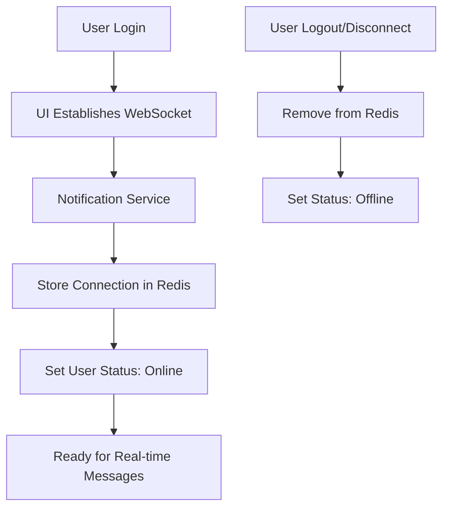

#### Broadcast Message Flow

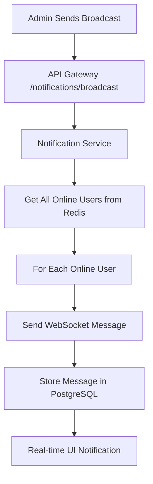

### 6. API Gateway Features

#### Request Routing Flow

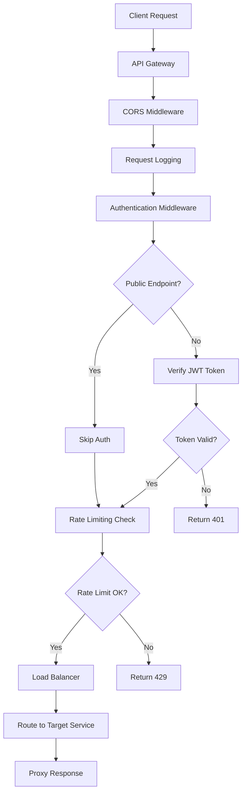

#### Load Balancing Flow

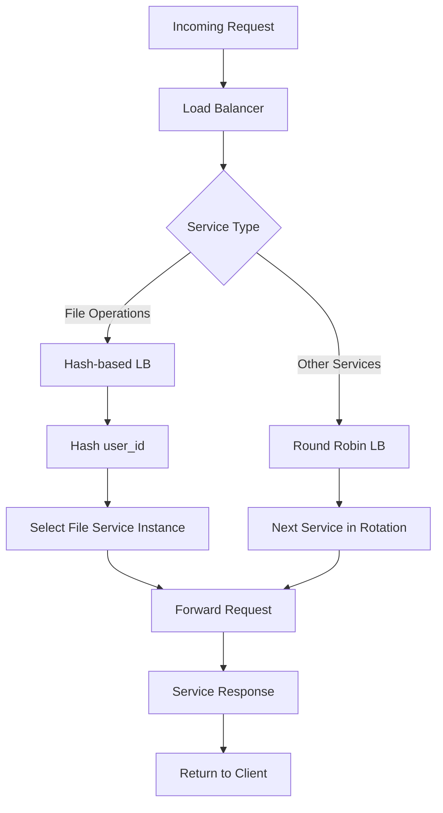

### 7. Dashboard and Analytics

#### Dashboard Data Flow

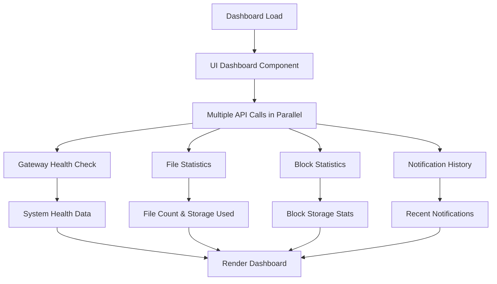

#### Activity Logging Flow

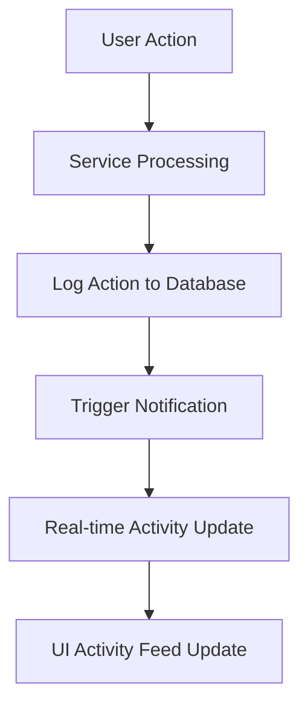

### 8. File Sharing System

#### Share File Flow

```mermaid
flowchart TD
    A[User Shares File] --> B[UI Share Dialog]
    B --> C[API Gateway /files/{file_id}/share]
    C --> D[File Service]
    D --> E[Create Share Record]
    E --> F[Generate Share Token/Link]
    F --> G[Store in PostgreSQL]
    G --> H[Send Notification to Recipients]
    H --> I[Return Share Details]
    I --> J[Display Share Link/Status]
```

#### Access Shared File Flow

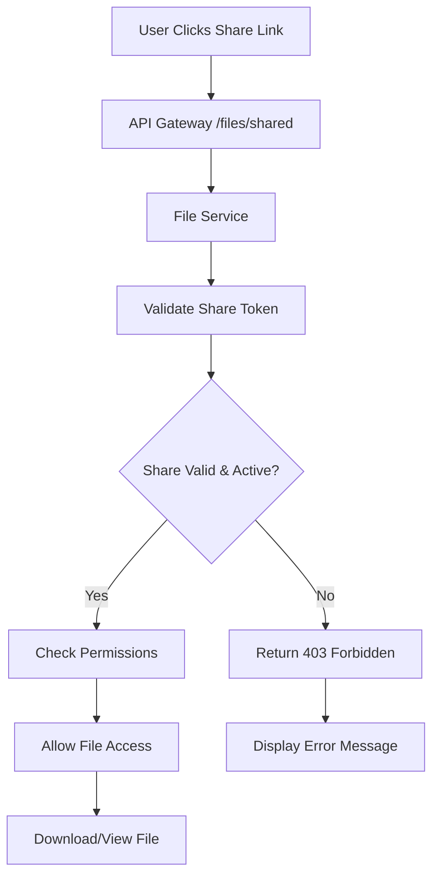

---

## Data Storage Schema

### PostgreSQL Tables

#### Users Table (Auth Service)
- `user_id` (UUID, Primary Key)
- `email` (VARCHAR, Unique)
- `username` (VARCHAR)
- `password_hash` (VARCHAR)
- `created_at` (TIMESTAMP)
- `updated_at` (TIMESTAMP)

#### Files Table (File Service)
- `file_id` (UUID, Primary Key)
- `user_id` (UUID, Foreign Key)
- `filename` (VARCHAR)
- `size` (BIGINT)
- `content_type` (VARCHAR)
- `checksum` (VARCHAR)
- `storage_path` (VARCHAR)
- `upload_date` (TIMESTAMP)
- `is_deleted` (BOOLEAN)

#### File Metadata Table (Metadata Service)
- `metadata_id` (UUID, Primary Key)
- `file_id` (UUID, Foreign Key)
- `user_id` (UUID, Foreign Key)
- `filename` (VARCHAR)
- `size` (BIGINT)
- `content_type` (VARCHAR)
- `tags` (TEXT)
- `folder_path` (VARCHAR)
- `created_at` (TIMESTAMP)
- `updated_at` (TIMESTAMP)

#### File Blocks Table (Block Service)
- `block_id` (UUID, Primary Key)
- `file_id` (UUID, Foreign Key)
- `user_id` (UUID, Foreign Key)
- `block_number` (INTEGER)
- `size` (INTEGER)
- `checksum` (VARCHAR)
- `storage_path` (VARCHAR)
- `encrypted` (BOOLEAN)
- `created_at` (TIMESTAMP)

#### Shared Files Table (File Service)
- `share_id` (UUID, Primary Key)
- `file_id` (UUID, Foreign Key)
- `owner_id` (UUID, Foreign Key)
- `shared_with` (UUID, Foreign Key)
- `permissions` (VARCHAR)
- `expires_at` (TIMESTAMP)
- `created_at` (TIMESTAMP)

#### Notifications Table (Notification Service)
- `notification_id` (UUID, Primary Key)
- `user_id` (UUID, Foreign Key)
- `type` (VARCHAR)
- `title` (VARCHAR)
- `message` (TEXT)
- `is_read` (BOOLEAN)
- `created_at` (TIMESTAMP)

### Redis Data Structures

#### User Sessions
- Key: `session:{user_id}`
- Type: String
- Value: JWT token data
- TTL: 24 hours

#### Rate Limiting
- Key: `rate_limit:{user_id}`
- Type: String
- Value: Request count
- TTL: 60 seconds

#### Online Users (WebSocket)
- Key: `online_users`
- Type: Set
- Value: Set of user_ids currently connected

#### User Status
- Key: `user_status:{user_id}`
- Type: Hash
- Fields: `status`, `last_seen`, `socket_id`

### MinIO Object Storage

#### File Storage Structure
```
bucket: gdrive-files
├── {user_id}/
│   ├── {file_id}
│   └── {file_id}
```

#### Block Storage Structure
```
bucket: gdrive-blocks
├── {user_id}/
│   ├── {file_id}/
│   │   ├── block_0
│   │   ├── block_1
│   │   └── block_n
```

---

## Security Features

### Authentication & Authorization Flow

```mermaid
flowchart TD
    A[Request] --> B[API Gateway]
    B --> C[Extract JWT Token]
    C --> D[Auth Service Verification]
    D --> E{Token Valid?}
    E -->|Yes| F[Extract user_id]
    E -->|No| G[Return 401]
    F --> H[Rate Limiting Check]
    H --> I{Within Limits?}
    I -->|Yes| J[Forward to Service]
    I -->|No| K[Return 429]
    J --> L[Service Authorization]
    L --> M{User Owns Resource?}
    M -->|Yes| N[Process Request]
    M -->|No| O[Return 403]
```

### Data Encryption Flow

```mermaid
flowchart TD
    A[File Upload] --> B[Generate AES Key]
    B --> C[Encrypt File Content]
    C --> D[Store Encrypted in MinIO]
    D --> E[Encrypt AES Key with Master Key]
    E --> F[Store Key in PostgreSQL]
    
    G[File Download] --> H[Retrieve Encrypted Key]
    H --> I[Decrypt with Master Key]
    I --> J[Retrieve Encrypted File]
    J --> K[Decrypt File Content]
    K --> L[Stream to User]
```

---

## Error Handling and Monitoring

### Error Flow

```mermaid
flowchart TD
    A[Error Occurs] --> B[Service Error Handler]
    B --> C[Log Error Details]
    C --> D[Determine Error Type]
    D --> E{Client Error 4xx?}
    E -->|Yes| F[Return User-Friendly Message]
    E -->|No| G{Server Error 5xx?}
    G -->|Yes| H[Log for Investigation]
    H --> I[Return Generic Error Message]
    F --> J[Client Handles Error]
    I --> J
```

### Health Check Flow

```mermaid
flowchart TD
    A[Health Check Request] --> B[Service Health Endpoint]
    B --> C[Check Database Connection]
    C --> D[Check External Dependencies]
    D --> E[Check Service Status]
    E --> F{All Healthy?}
    F -->|Yes| G[Return 200 OK]
    F -->|No| H[Return 503 Service Unavailable]
    G --> I[Load Balancer: Keep in Rotation]
    H --> J[Load Balancer: Remove from Rotation]
```

---

## Performance Optimizations

### Caching Strategy

```mermaid
flowchart TD
    A[Request] --> B[Check Redis Cache]
    B --> C{Cache Hit?}
    C -->|Yes| D[Return Cached Data]
    C -->|No| E[Query Database]
    E --> F[Store Result in Redis]
    F --> G[Return Fresh Data]
    D --> H[Fast Response < 10ms]
    G --> I[Normal Response ~100ms]
```

### File Chunking for Large Files

```mermaid
flowchart TD
    A[Large File > 100MB] --> B[Split into 10MB Chunks]
    B --> C[Upload Chunks in Parallel]
    C --> D[Block Service Processing]
    D --> E[Store Block Metadata]
    E --> F[Provide Download Resumability]
    F --> G[Reassemble on Download]
```

This comprehensive documentation covers all the major features and data flows in the Google Drive MVP system. Each flow shows how data moves through the system, what services are involved, and what data transformations occur at each step.