# Google Maps Clone - Data Flow Diagrams

Simple and clear data flow diagrams showing how the UI interacts with backend services.

## System Architecture

## 1. Traffic Flow

### User Views Traffic on Map

### Background Traffic Updates

## 2. Places Discovery Flow

### User Discovers Places

### Available Categories

```mermaid
graph LR
    A[Categories] --> B[🍽️ Restaurants]
    A --> C[⛽ Gas Stations]
    A --> D[🏨 Hotels]
    A --> E[🛍️ Shopping]
    A --> F[🏥 Hospitals]
    
    style A fill:#fff3e0
```

## 3. Search Flow

### User Searches Places

## 4. Navigation Flow

### Route Planning

### Turn-by-Turn Navigation

## 5. Map Interactions

### Basic Map Controls

## 6. Error Handling

### When Services Fail

## 7. Real-Time Updates

### Background Timers

---

## API Endpoints Summary

### Location Service (Port 8086)
- `GET /api/traffic/data` - Get real-time traffic information
- `POST /api/traffic/start-simulation` - Start traffic simulation
- `GET /api/locations/stats` - Get location service statistics
- `GET /health` - Service health check

### Navigation Service (Port 8081)  
- `POST /api/navigation/route` - Calculate route between points
- `POST /api/navigation/reroute` - Recalculate route from current position
- `GET /health` - Service health check

### Places Service (Port 8083)
- `GET /api/v1/places/listings` - Get business listings by category/location
- `POST /api/v1/places/search` - Search places by query
- `GET /api/v1/places/{id}/details` - Get detailed place information
- `GET /api/v1/places/{id}/reviews` - Get place reviews and ratings
- `GET /health` - Service health check

### Traffic Service (Port 8084)
- `GET /api/traffic/realtime` - Get real-time traffic updates
- `GET /health` - Service health check

### Web UI (Port 3002)
- `/` - Main application interface
- `/maps` - Interactive map view
- WebSocket connections for real-time updates

---

*This dataflow diagram provides a comprehensive view of all data flows supported by the Google Maps Clone UI, showing the complete journey from user interactions to backend services and data storage.*