# Hotel Booking System - Complete Data Flow Diagrams

## System Architecture Overview

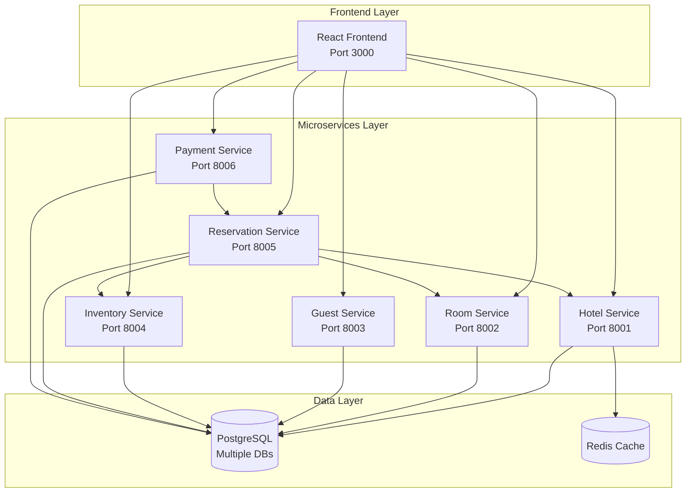

---

## 1. User Registration & Authentication Flow

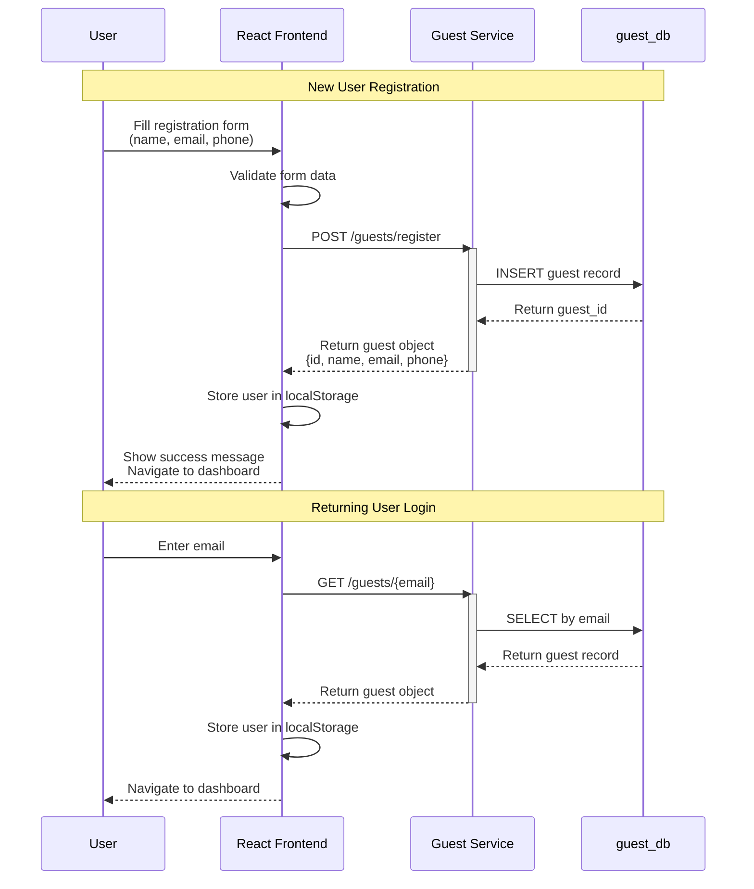

**Key Data Points:**
- Guest ID generation using UUID
- Email as unique identifier
- No password authentication (demo system)
- Local storage for session management

---

## 2. Hotel Search & Browsing Flow

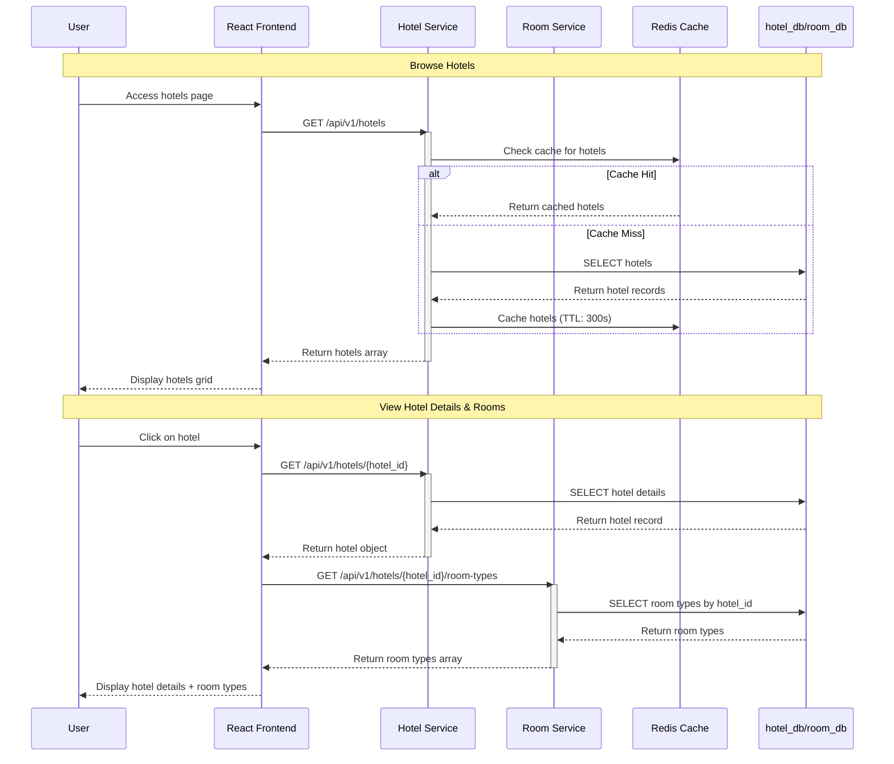

**Key Data Points:**
- Redis caching for improved performance
- Hotel details include: name, address, location
- Room types include: name, max_occupancy, base_price

---

## 3. Room Booking & Reservation Flow

### 3A. Check Availability
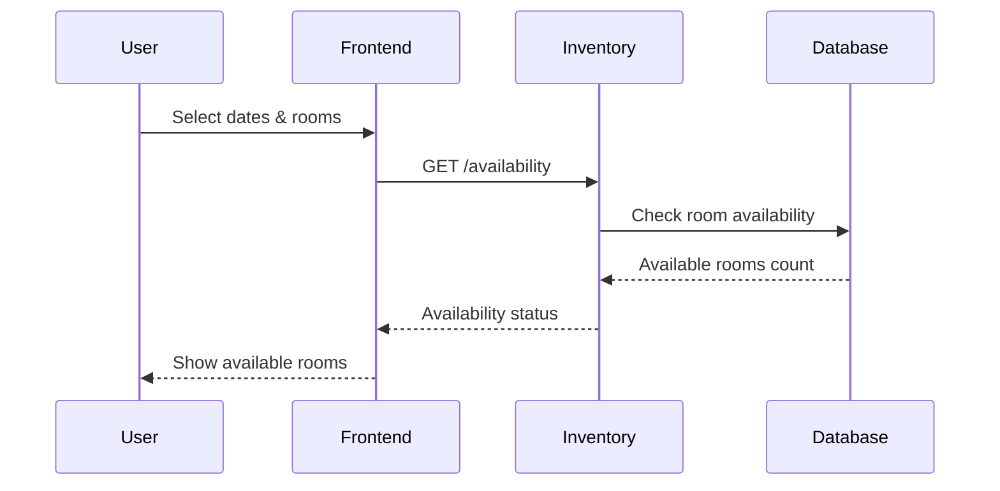

### 3B. Create Reservation (Atomic Transaction)
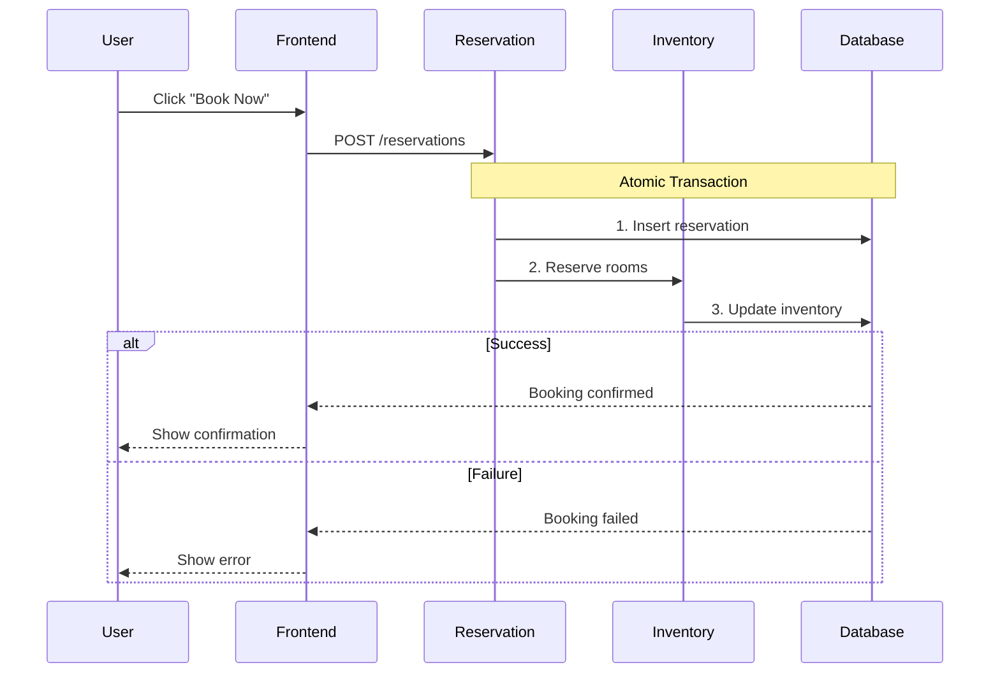

**Key Features:**
- ✅ Concurrency control prevents overbooking
- ✅ Atomic transactions ensure data consistency
- ✅ Real-time availability checking
- ✅ Database constraints for safety

---

## 4. Payment Processing Flow

### 4A. Load Payment Page
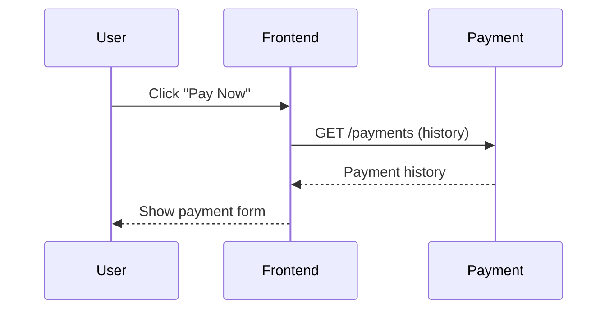

### 4B. Process Payment
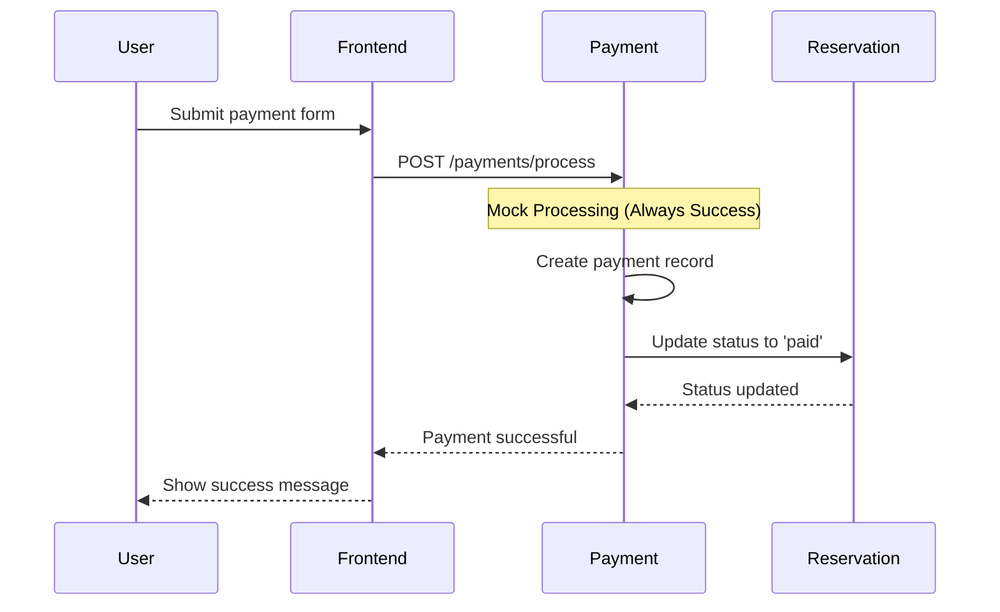

**Key Features:**
- 💳 Mock payment processing (demo purposes)
- 🌍 Multi-currency support (USD, EUR, GBP, JPY, CAD)
- 📱 Multiple payment methods (Card, PayPal, etc.)
- 🔄 Automatic reservation status update
- 📊 Payment history tracking

---

## 5. Reservation Management Flow

### 5A. Load Reservations with Data Enrichment
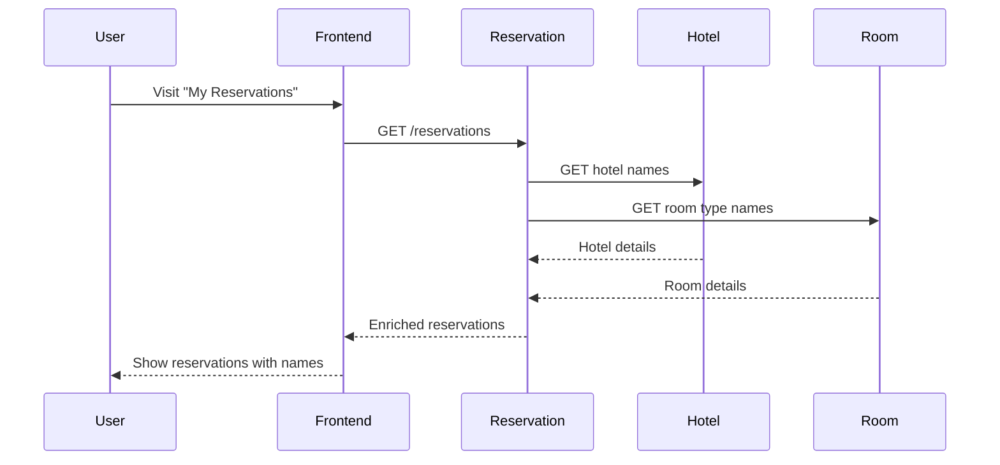

### 5B. Cancel Reservation
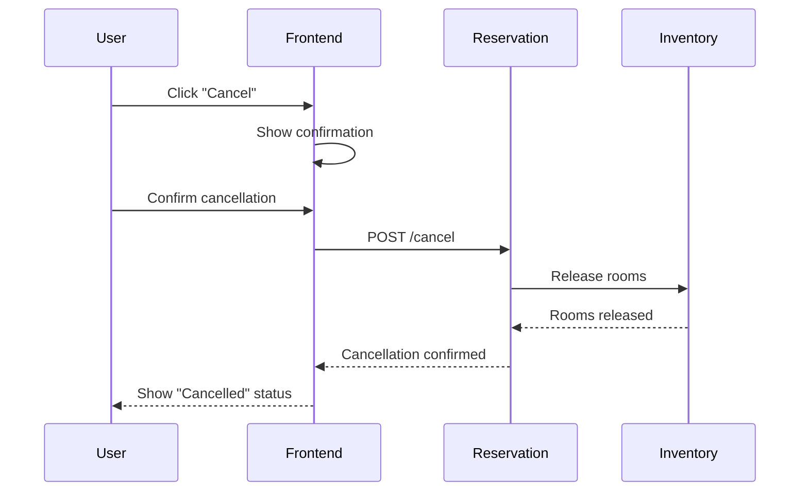

**Key Features:**
- 🔍 Real-time data enrichment (hotel/room names)
- 🔗 Cross-service communication
- 📊 Status tracking (confirmed, paid, cancelled)
- 🔄 Automatic inventory release on cancellation

---

## 6. Inventory Management Flow (Admin)

### 6A. Add New Hotel & Rooms
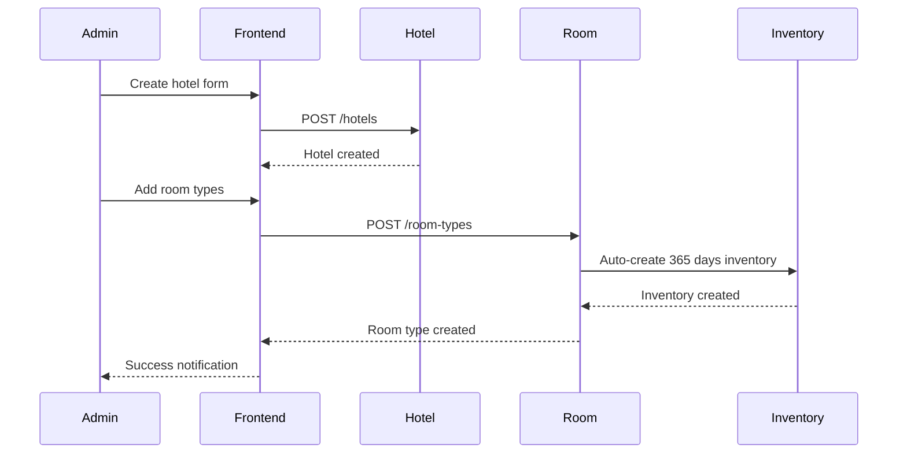

### 6B. Monitor Availability
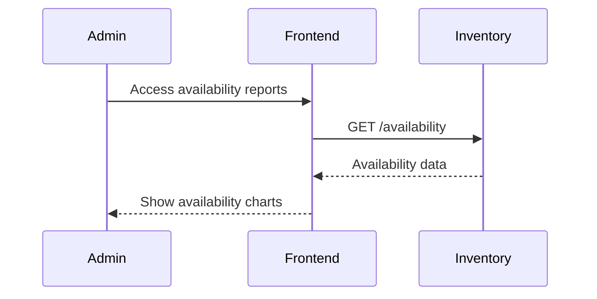

**Key Features:**
- 🏨 Automatic hotel & room setup
- 📅 Auto-create 365 days inventory (10 rooms/day)
- 📊 Real-time availability monitoring
- 🛡️ Constraint-based overbooking prevention
- 💰 Dynamic pricing capability

---

## 7. System Architecture & Data Flow Summary

### Service Communication Patterns:
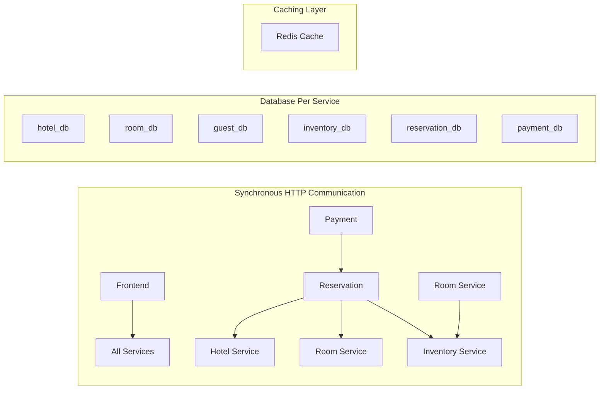

### Key Technical Features Demonstrated:

1. **Microservices Architecture**
   - 6 independent services
   - Database per service pattern
   - Service-to-service communication

2. **Concurrency Control**
   - Database constraints prevent overbooking
   - Atomic transactions for reservations
   - Row-level locking in PostgreSQL

3. **Caching Strategy**
   - Redis for hotel data (5-minute TTL)
   - Reduces database load
   - Improved response times

4. **Data Consistency**
   - Cross-service data enrichment
   - Eventually consistent across services
   - Graceful error handling

5. **Scalability Patterns**
   - Stateless services
   - Horizontal scaling ready
   - Load balancer friendly

### Demo Flow Recommendations:

1. **Start with Registration** → Show user onboarding
2. **Hotel Browsing** → Demonstrate caching and search
3. **Booking Process** → Highlight concurrency control
4. **Payment Flow** → Show cross-service communication
5. **Reservation Management** → Display data enrichment
6. **Admin Functions** → Demonstrate inventory management

Each flow demonstrates specific microservices patterns and can be used to explain different architectural concepts in your demo presentations.

---

## 🎯 Quick Demo Reference Guide

### **Simple Flows (Start Here):**
1. **User Registration** → Simple CRUD operation
2. **Hotel Browsing** → Caching demonstration
3. **Payment Processing** → Cross-service communication

### **Complex Flows (Advanced Topics):**
4. **Room Booking** → Concurrency control & atomic transactions
5. **Reservation Management** → Data enrichment patterns
6. **Inventory Management** → Admin workflows & automation

### **Key Demo Points:**
- **Architecture**: Show system overview first
- **Scalability**: Highlight stateless services & caching
- **Reliability**: Demonstrate atomic transactions & constraints
- **Performance**: Show Redis caching in hotel browsing
- **Data Consistency**: Explain cross-service data enrichment

### **Technical Highlights:**
```
✅ Microservices (6 services)    ✅ PostgreSQL per service
✅ Redis caching                 ✅ Docker containerization  
✅ Atomic transactions          ✅ Cross-service communication
✅ Concurrency control          ✅ Real-time data enrichment
```