# Hotel Booking System - Customer Demo Diagrams

## 🏗️ System Architecture

---

## 📝 User Registration Flow

---

## 🏨 Browse Hotels Flow

```mermaid
flowchart TD
    A[Customer browses hotels] --> B[System shows hotel list]
    B --> C[Customer clicks on hotel]
    C --> D[System shows:<br/>• Hotel details<br/>• Available rooms<br/>• Prices]
    
    style A fill:#fff3e0
    style D fill:#fff3e0
```

---

## 🎯 Book Room Flow

---

## 💳 Payment Flow

```mermaid
flowchart TD
    A[Customer clicks Pay Now] --> B[Payment form opens]
    B --> C[Customer enters:<br/>• Card details<br/>• Amount<br/>• Currency]
    C --> D[System processes payment]
    D --> E[Payment successful!<br/>Booking status: PAID]
    
    style A fill:#f3e5f5
    style E fill:#c8e6c9
```

---

## 📋 View Bookings Flow

```mermaid
flowchart TD
    A[Customer clicks My Bookings] --> B[System shows all bookings]
    B --> C[For each booking shows:<br/>• Hotel name<br/>• Room type<br/>• Dates<br/>• Status<br/>• Total amount]
    C --> D{Want to cancel?}
    D -->|Yes| E[Click Cancel → Booking cancelled]
    D -->|No| F[View booking details]
    
    style A fill:#e8f5e8
    style E fill:#ffcdd2
    style F fill:#e3f2fd
```

---

## 🔧 Admin Management Flow

---

## 🎯 Key Demo Features

### ✅ Customer Features:
- **Easy Registration** - Just name, email, phone
- **Hotel Search** - Browse all available hotels  
- **Room Booking** - Select dates, book instantly
- **Secure Payment** - Multiple payment methods
- **Booking Management** - View and cancel bookings

### ✅ Admin Features:
- **Hotel Management** - Add hotels and rooms
- **Inventory Control** - Automatic room availability
- **Booking Oversight** - View all customer bookings
- **Reports** - Real-time availability reports

### ✅ Technical Features:
- **Microservices** - 6 independent services
- **Real-time** - Instant availability checking
- **Scalable** - Each service can scale independently  
- **Reliable** - Database per service design
- **Fast** - Redis caching for performance

---

## 🎬 Demo Script Suggestions

### **1. Start with Architecture (30 seconds)**
*"This is our microservices hotel booking system with 6 independent services..."*

### **2. Customer Journey (2-3 minutes)**
*"Let me show you the complete customer experience..."*
- Register new customer
- Browse hotels  
- Book a room
- Make payment
- View bookings

### **3. Admin Features (1-2 minutes)**  
*"Now let me show the admin management features..."*
- Add new hotel
- Create room types
- View booking reports

### **4. Technical Highlights (1 minute)**
*"Behind the scenes, we have enterprise-grade features..."*
- Microservices architecture
- Real-time processing
- Scalable design
- Reliable data storage

---

## 💡 Demo Tips

### **For Customers:**
- Focus on **user experience** and **ease of use**
- Highlight **booking speed** and **payment security**
- Show **mobile responsiveness**
- Demonstrate **real-time availability**

### **For Technical Audience:**
- Emphasize **microservices architecture**
- Show **database independence**  
- Highlight **scalability features**
- Discuss **concurrency handling**

### **For Business Stakeholders:**
- Focus on **revenue features** (multiple payment methods)
- Show **inventory management** efficiency
- Highlight **customer experience** improvements
- Demonstrate **reporting capabilities**