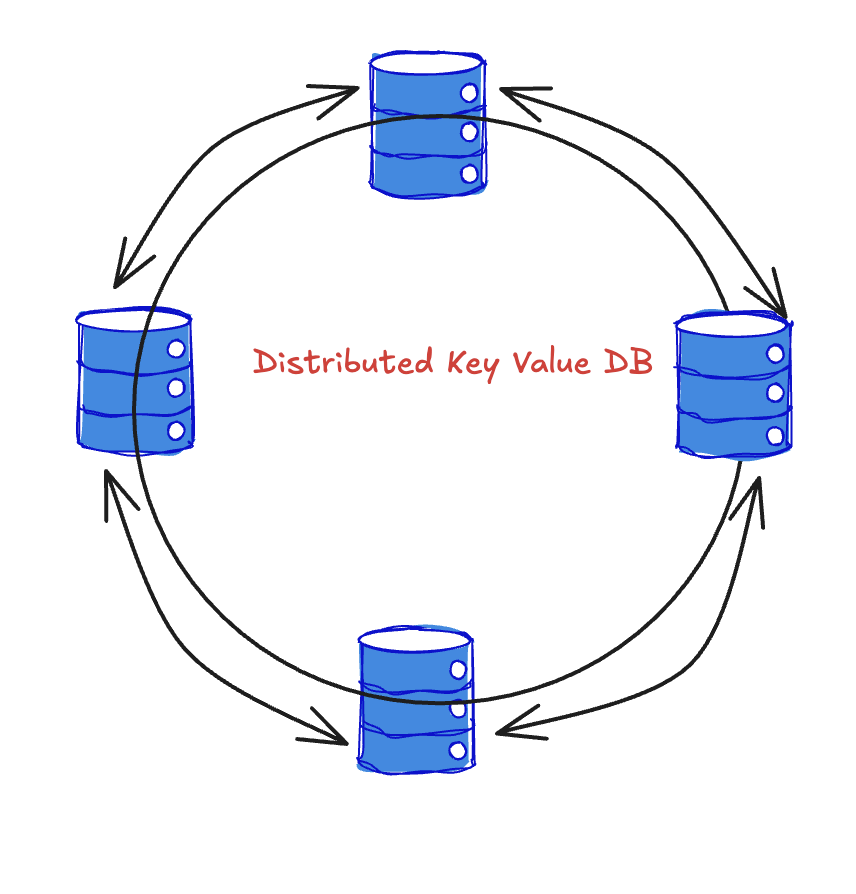

# Intelli KV DB

A production-ready distributed NoSQL key-value database implementation with advanced features including replication, anti-entropy synchronization, causal consistency, vector clocks, and comprehensive monitoring.



## 🚀 Features

### Core Database Features
- **Distributed Architecture**: Multi-node cluster with gossip protocol and robust hashing
- **Replication**: Automatic data replication across nodes with configurable replication factor
- **Anti-Entropy**: Merkle tree-based synchronization for data consistency
- **Causal Consistency**: Vector clock implementation for ordering operations
- **Persistence**: SSTable and commit log storage with cache management
- **Consistent Hashing**: Dynamic data distribution and load balancing
- **Failure Detection**: Automatic node failure detection and recovery

### Professional Features
- **Health Monitoring**: Built-in health checks and real-time monitoring
- **Live Dashboard**: Web-based dashboard for cluster visualization and operations
- **Hash Ring Analysis**: Comprehensive APIs for virtual node details, key distribution, and migration analysis
- **Cluster Management**: Dynamic node addition/removal with process management

- **Kubernetes Ready**: Full Kubernetes deployment with StatefulSets and services
- **Docker Support**: Containerized deployment with health checks
- **Professional Logging**: Structured logging with centralized log management

## 📁 Project Structure

```
├── distributed/           # Core distributed database implementation
│   ├── lib/              # Shared libraries and utilities
│   ├── node.py           # Main node implementation
│   ├── kvstore.py        # Key-value store implementation
│   ├── health.py         # Health monitoring and checks
│   └── logging_utils.py  # Logging utilities
├── persistence/          # Data persistence layer
│   ├── sstable.py        # SSTable implementation
│   ├── commit_log.py     # Commit log for durability
│   ├── cache.py          # In-memory cache management
│   └── persistence_lib.py # Persistence utilities
├── demo/                 # Testing and demonstration scripts
│   ├── cluster_demo_runner_local.py    # Local cluster demo runner
│   ├── cluster_demo_runner.py          # Kubernetes cluster demo runner
│   ├── test_utils.py                   # Professional testing utilities
│   ├── vector_clock_db_demo.py         # Vector clock demonstrations
│   ├── anti_entropy_demo.py            # Anti-entropy demonstrations
│   └── [various demo files]            # Feature-specific demos
├── dashboard/            # Web-based monitoring dashboard
│   ├── dashboard.html    # Main dashboard interface
│   ├── persistence_dashboard.html      # Persistence monitoring
│   └── serve-dashboard.py              # Dashboard server
├── config/               # Configuration files
│   ├── config.yaml       # Main configuration
│   └── yaml_config.py    # Configuration utilities
├── scripts/              # DevOps and deployment automation
│   ├── start-cluster-local.sh          # Local cluster startup
│   ├── build-and-deploy.sh             # Kubernetes deployment

│   ├── cleanup-test-artifacts.sh       # Test cleanup utilities
│   └── [various utility scripts]       # Additional automation
├── yaml/                 # Kubernetes manifests
│   ├── k8s-stateful-set.yaml           # StatefulSet configuration
│   ├── k8s-service.yaml                # Service configuration
│   ├── k8s-config-map.yaml             # ConfigMap
│   └── [various K8s configs]           # Additional K8s resources
├── local-k8s/            # Local Kubernetes deployment
├── data/                 # Data storage directories
├── logs/                 # Log files (created during operation)
└── md-files/             # Documentation guides
```

## 🛠️ Quick Start

### Prerequisites
- Python 3.8+
- Docker (for containerized deployment)
- Kubernetes (Kind, Minikube, or cloud cluster)

### Installation
```bash
# Clone the repository
git clone <repository-url>
cd IntelliKV-DB

# Install dependencies
pip install -r requirements.txt
```

### Local Development
```bash
# Step 1: Start local cluster
./standalone/start-cluster-local.sh

# Step 2: Run tests against the running cluster
python demo/cluster_demo_runner.py vector_clock_db --config config/config-local.yaml --use-existing

# Run with professional mode (includes cleanup and logging)
python demo/cluster_demo_runner.py vector_clock_db --config config/config-local.yaml --use-existing --professional
```

### Kubernetes Deployment
```bash
# Deploy to Kind cluster
./scripts/build-and-deploy.sh full
```

## 📚 Available Demos

The project includes comprehensive demonstrations of all features:

- **`vector_clock_db`**: Vector clock functionality with causal consistency
- **`convergence`**: Multi-node convergence and conflict resolution
- **`anti_entropy`**: Anti-entropy synchronization between nodes
- **`automated_anti_entropy`**: Automated anti-entropy with data verification
- **`consistent_hashing`**: Consistent hashing and data distribution
- **`replication`**: Data replication and consistency
- **`persistence_anti_entropy`**: Persistence with anti-entropy
- **`quick`**: Quick overview of all features

### Running Demos
```bash
# Run demo on existing cluster (Kubernetes)
python demo/cluster_demo_runner.py vector_clock_db --config config/config.yaml --use-existing

# Run demo on existing cluster (Local)
python demo/cluster_demo_runner_local.py vector_clock_db --config config/config-local.yaml --use-existing

# Run with professional mode (Kubernetes)
python demo/cluster_demo_runner.py vector_clock_db --config config/config.yaml --use-existing --professional

# Run with professional mode (Local)
python demo/cluster_demo_runner_local.py vector_clock_db --config config/config-local.yaml --use-existing --professional
```

## 🔧 Configuration

### Main Configuration (`config/config.yaml`)
```yaml
database:
  persistent_port: 55201
  db_port: 8080

node:
  node_id: "distributed-database-0"
  host: "0.0.0.0"
  http_port: 8080

cluster:
  seed_nodes:
    - id: "distributed-database-0"
      host: "localhost"
      http_port: 8080
      gossip_port: 25101
      anti_entropy_port: 55301
      monitoring_port: 55401
  replication_factor: 3

consistency:
  default_read: "ONE"
  default_write: "ONE"

timing:
  failure_check_interval: 2.0
  failure_threshold: 3
  anti_entropy_interval: 30.0
```

## 📊 Monitoring & Dashboard

### Health Endpoints
- **Health Check**: `http://localhost:8080/health`
- **Cluster Info**: `http://localhost:8080/info`
- **Node Status**: `http://localhost:8080/status`

### Live Dashboard
```bash
# Start dashboard server
python dashboard/serve-dashboard.py
```

The dashboard server will start on port 3000 and provide instructions. You can then access the dashboard at:
- **Dashboard URL**: http://localhost:3000/dashboard.html

The dashboard provides:
- Real-time cluster topology visualization
- Node health status monitoring
- Live data operations interface
- Performance metrics
- Anti-entropy status
- Persistence monitoring

## 🧪 Professional Testing

The project includes a comprehensive professional testing framework:

### Features
- **Automatic Cleanup**: Removes all test artifacts before and after tests
- **Temporary Directories**: Isolated test environments
- **Professional Logging**: Structured logging to `logs/` directory
- **Test Result Tracking**: Metrics and performance tracking
- **Backward Compatibility**: Traditional and professional modes

### Usage
```bash
# Clean test runner with professional practices
./scripts/run-clean-tests.sh vector_clock_db

# Clean up old test artifacts
./scripts/cleanup-test-artifacts.sh

# Run tests with professional mode
python demo/cluster_demo_runner_local.py vector_clock_db --professional
```

## 🐳 Kubernetes (Local Kind Cluster)

```bash
# Build Docker image and deploy to Kind cluster (full mode)
./scripts/build-and-deploy.sh full

# Check deployment
kubectl get pods -n distributed-db

# Access service
kubectl port-forward svc/kvdb-service 8080:8080 -n distributed-db
```

## 📖 Documentation

Comprehensive guides are available in the `md-files/` directory:

- [Cluster Startup Guide](md-files/CLUSTER_STARTUP_GUIDE.md)
- [Demo Guide](md-files/DEMO_GUIDE.md)
- [Anti-Entropy Guide](md-files/ANTI_ENTROPY_GUIDE.md)
- [Causal Consistency Guide](md-files/CAUSAL_CONSISTENCY_GUIDE.md)
- [Vector Clock Implementation Guide](md-files/VECTOR_CLOCK_IMPLEMENTATION_GUIDE.md)
- [Kubernetes Testing Guide](md-files/KUBERNETES_TESTING_GUIDE.md)
- [Unified Demo Runner Guide](md-files/UNIFIED_DEMO_RUNNER_GUIDE.md)
- [Verification Scripts Guide](md-files/VERIFICATION_SCRIPTS.md)
- [CRDT Counters](md-files/CRDT_COUNTERS.md)
- [Hash Ring APIs](md-files/HASH_RING_APIS.md)
- [Hash Ring APIs - Quick Reference](md-files/HASH_RING_API_QUICK_REFERENCE.md)
- [Cluster Management APIs](md-files/CLUSTER_MANAGEMENT_APIS.md)


## 🛠️ Development

### Testing
```bash
# Run all demos
python demo/cluster_demo_runner_local.py --all

# Test specific features (creates new cluster)
python demo/cluster_demo_runner_local.py vector_clock_db
python demo/cluster_demo_runner_local.py anti_entropy
python demo/cluster_demo_runner_local.py replication

# Test against existing cluster
python demo/cluster_demo_runner_local.py vector_clock_db --use-existing
python demo/cluster_demo_runner_local.py anti_entropy --use-existing
python demo/cluster_demo_runner_local.py replication --use-existing


```

## 🔍 Troubleshooting

### Common Issues
1. **Port conflicts**: Check if ports 8080, 8081, 9999-10001 are available
2. **Cluster not forming**: Verify all nodes can reach each other
3. **Data persistence**: Check `/data` directory permissions
4. **Kubernetes issues**: Verify cluster is running and accessible

### Logs
- Application logs: `logs/` directory
- Kubernetes logs: `kubectl logs -n distributed-db <pod-name>`
- Docker logs: `docker logs <container-id>`

## 🤝 Contributing

1. Fork the repository
2. Create a feature branch
3. Make your changes
4. Add tests using the cluster demo runner with `--professional` flag
5. Ensure all tests pass
6. Submit a pull request

## 📄 License

This project is licensed under the MIT License. 

## 🏗️ Architecture Overview

The distributed database implements a sophisticated architecture with:

- **Gossip Protocol**: For cluster membership and failure detection
- **Vector Clocks**: For causal consistency and operation ordering
- **Anti-Entropy**: For data synchronization and consistency
- **Consistent Hashing**: For data distribution and load balancing
- **SSTable Storage**: For efficient data persistence
- **Commit Logs**: For durability and recovery
- **Health Monitoring**: For operational visibility

This architecture provides high availability, consistency, and performance for distributed key-value storage. 