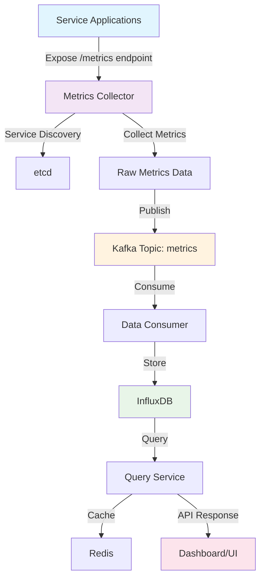
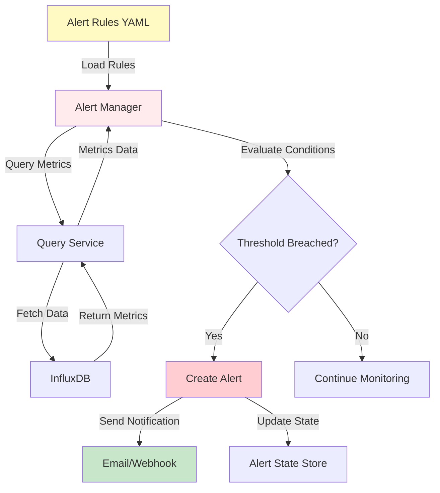
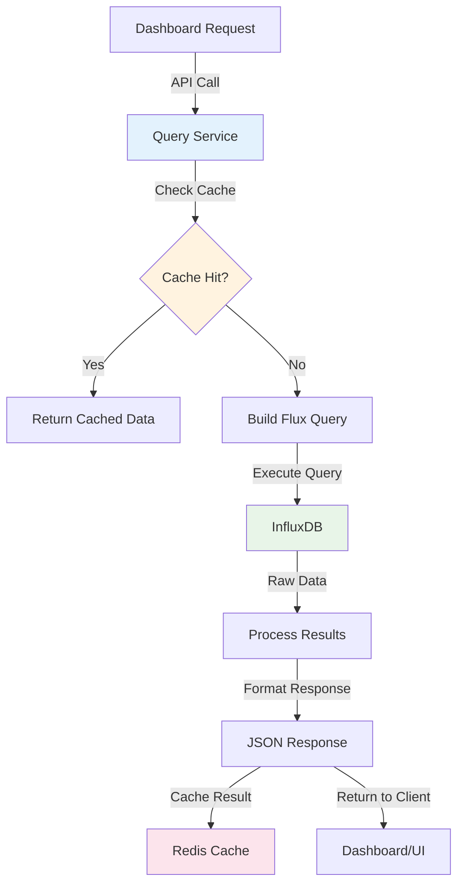
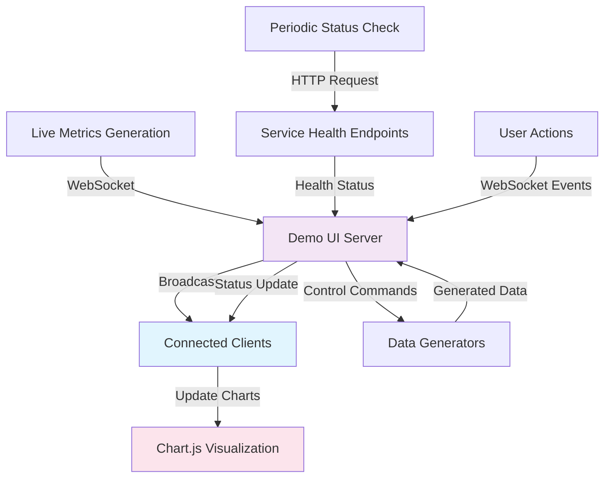
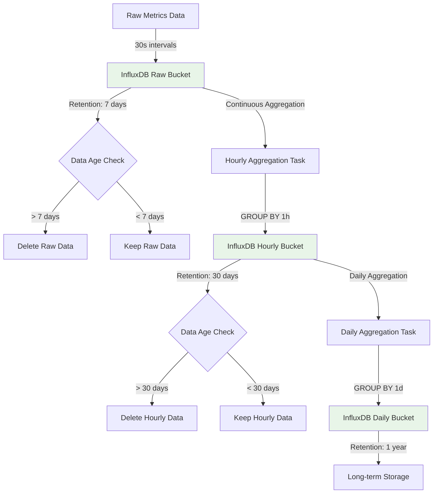
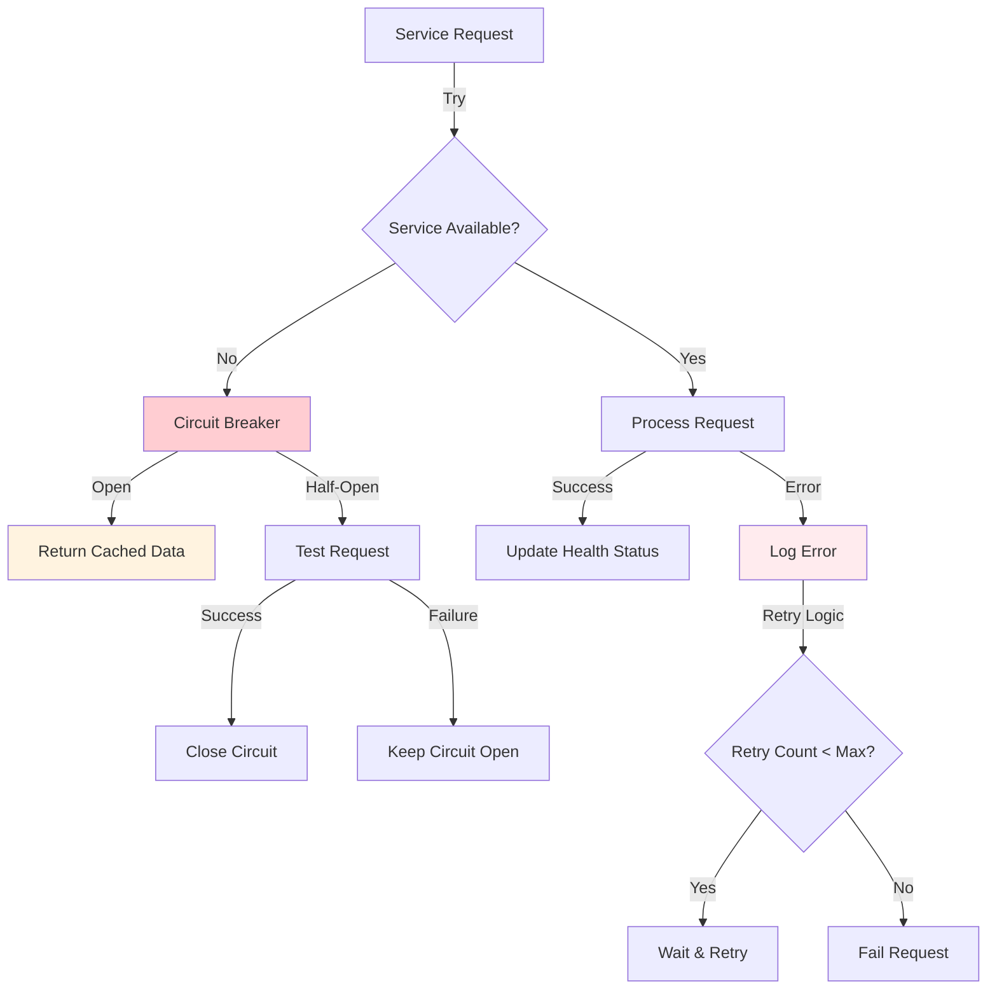
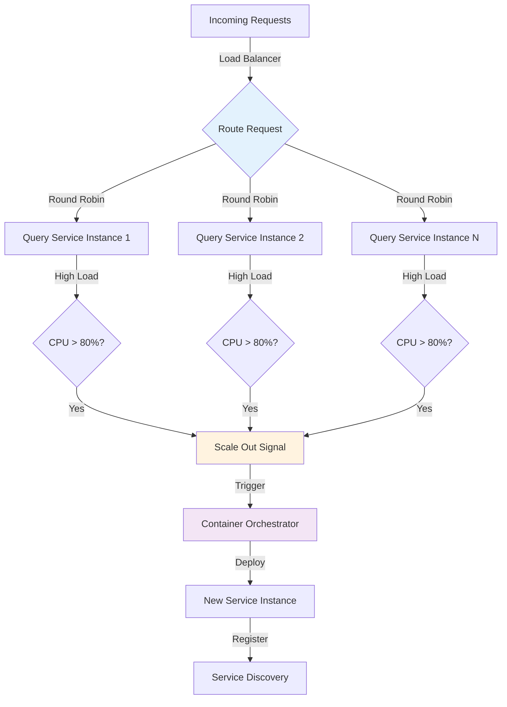
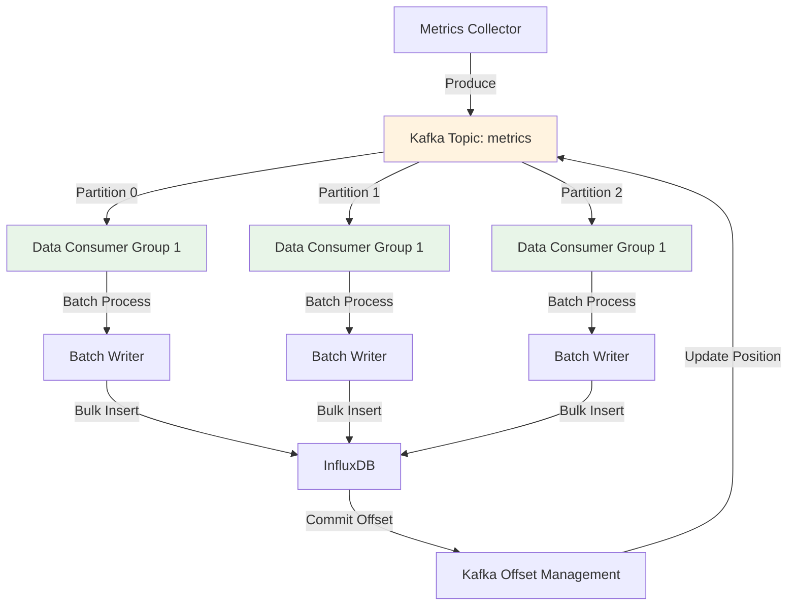
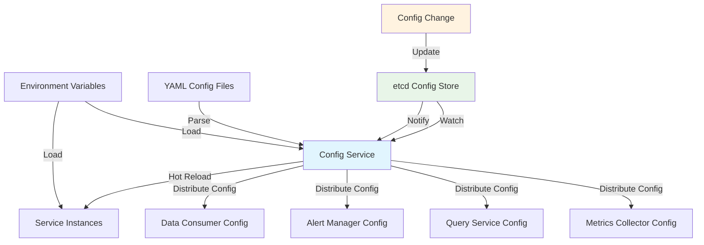

# Metrics Monitoring System - Data Flow Diagrams

This document illustrates the various data flows within the metrics monitoring system using Mermaid diagrams.

## 1. Core Metrics Collection Flow



## 2. Alert Processing Flow



## 3. Query Service Data Flow



## 4. Real-time Dashboard Update Flow



## 5. Service Discovery Flow

```mermaid
flowchart TD
    A[New Service Instance] -->|Register| B[etcd Key-Value Store]
    B -->|Service Info| C[/services/{service}/{instance}]
    C -->|Watch Changes| D[Metrics Collector]
    D -->|Update Target List| E[Collection Targets]
    E -->|Start Collection| F[Periodic Metrics Pull]
    F -->|HTTP GET /metrics| A
    
    G[Service Shutdown] -->|Deregister| B
    B -->|Delete Key| C
    C -->|Notify Change| D
    D -->|Remove Target| E
    
    style B fill:#e8f5e8
    style D fill:#f3e5f5
    style E fill:#fff3e0
```

## 6. Data Storage and Retention Flow



## 7. Error Handling and Resilience Flow



## 8. Load Balancing and Scaling Flow



## 9. Kafka Message Processing Flow



## 10. Configuration Management Flow



## Architecture Overview

The system follows a microservices architecture with the following key components:

- **Metrics Collector**: Pull-based metrics collection with service discovery
- **Kafka**: Message queue for decoupling data ingestion from storage
- **Data Consumer**: Batch processing and data transformation
- **InfluxDB**: Time-series database optimized for metrics storage
- **Query Service**: High-performance API with Redis caching
- **Alert Manager**: Rule-based alerting with multiple notification channels
- **Dashboard**: Real-time visualization with WebSocket updates

## Data Flow Characteristics

- **Throughput**: Supports 10M+ metrics per day
- **Query Performance**: < 100ms average response time with caching
- **Reliability**: Circuit breakers and retry logic for fault tolerance
- **Scalability**: Horizontal scaling with Kafka partitioning
- **Real-time**: WebSocket connections for live dashboard updates