# Nearby Friends System - Data Flow Documentation

This document illustrates all data flows in the Nearby Friends system using Mermaid diagrams.

## 1. System Architecture Overview

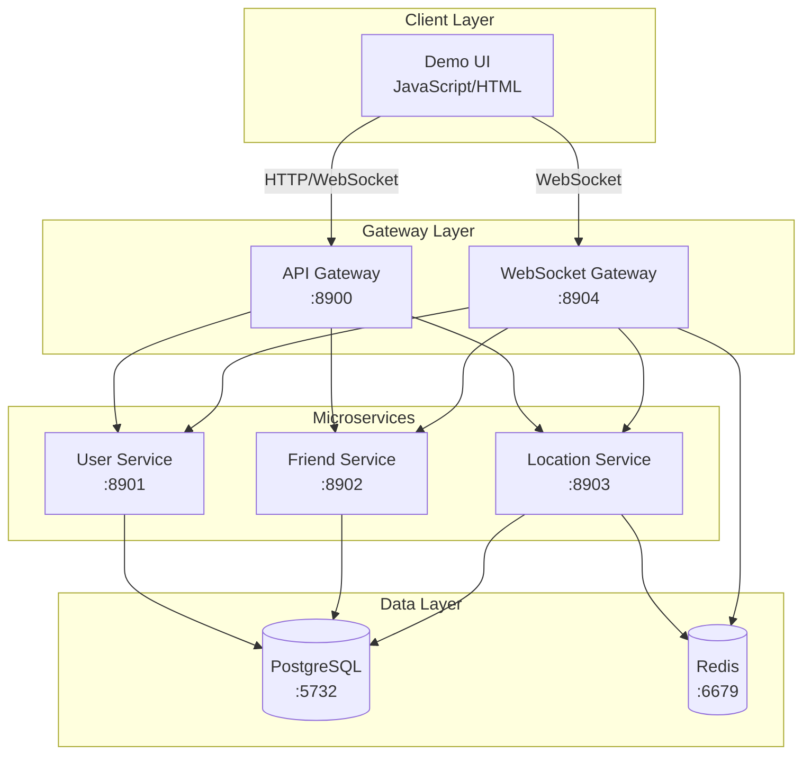

## 2. User Authentication Flow

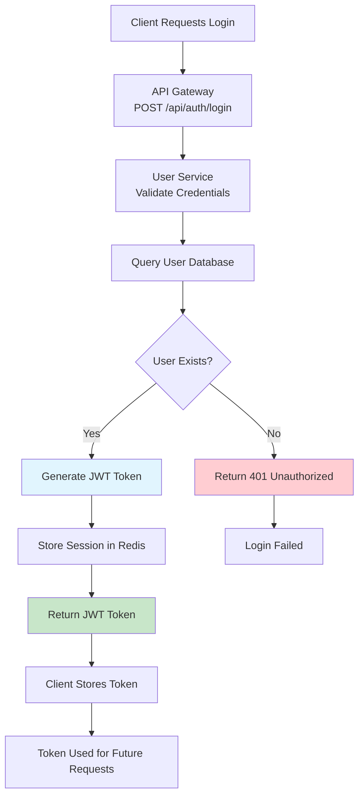

## 3. User Registration Flow

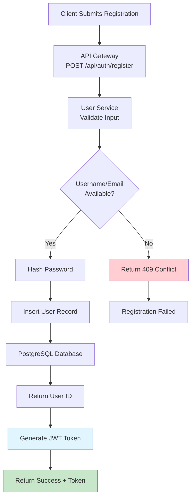

## 4. Friend Relationship Management

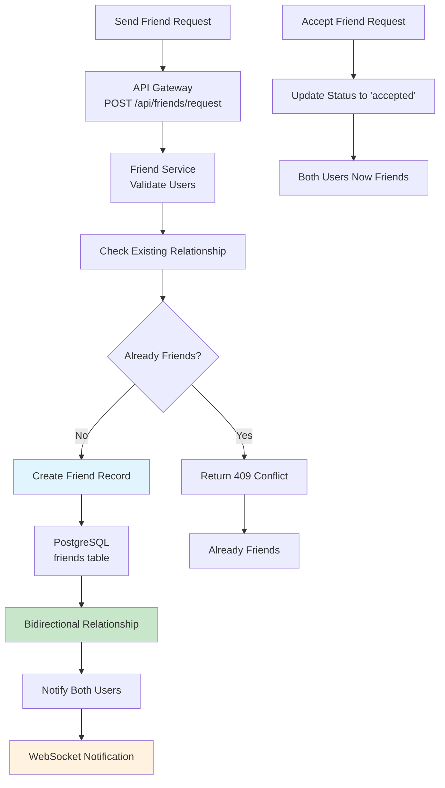

## 5. Location Update Flow

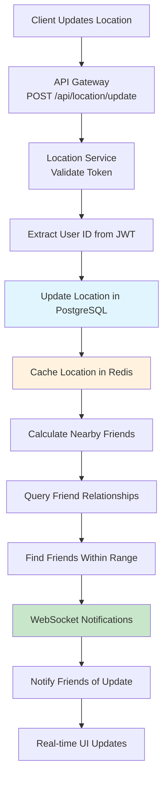

## 6. Nearby Friends Query Flow

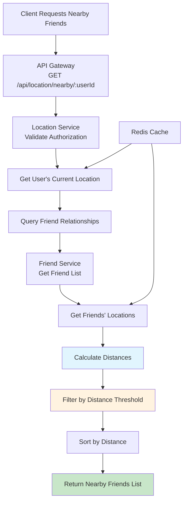

## 7. Real-time WebSocket Communication

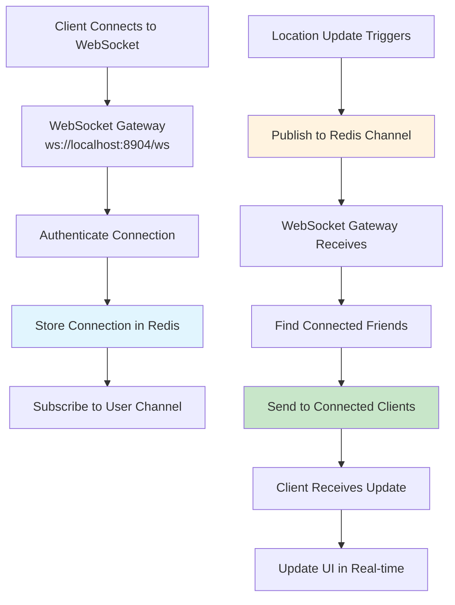

## 8. Distance Calculation Algorithm

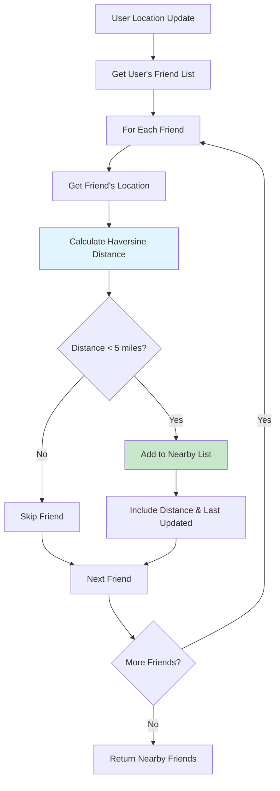

## 9. Cache Management Flow

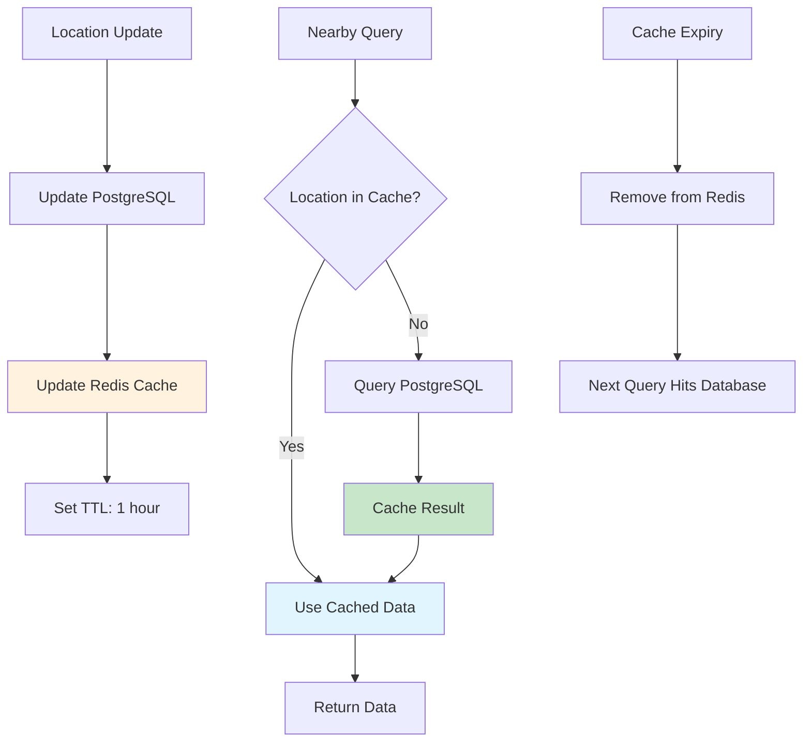

## 10. Demo Data Flow

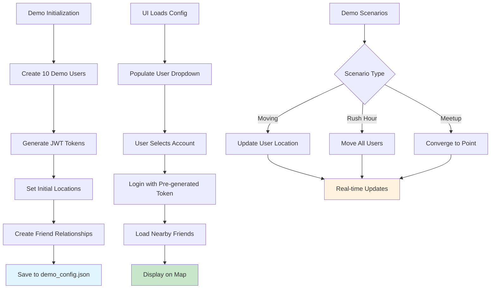

## 11. Error Handling Flow

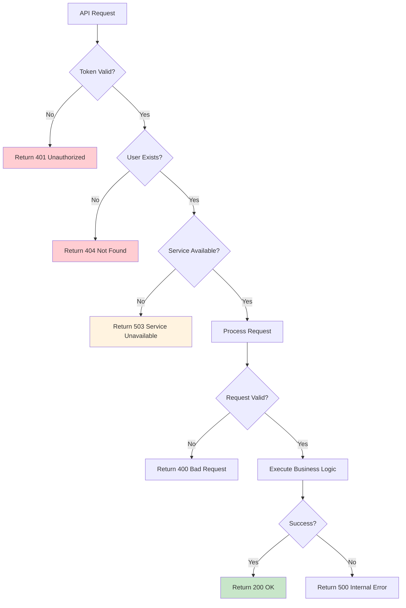

## 12. Database Schema Data Flow

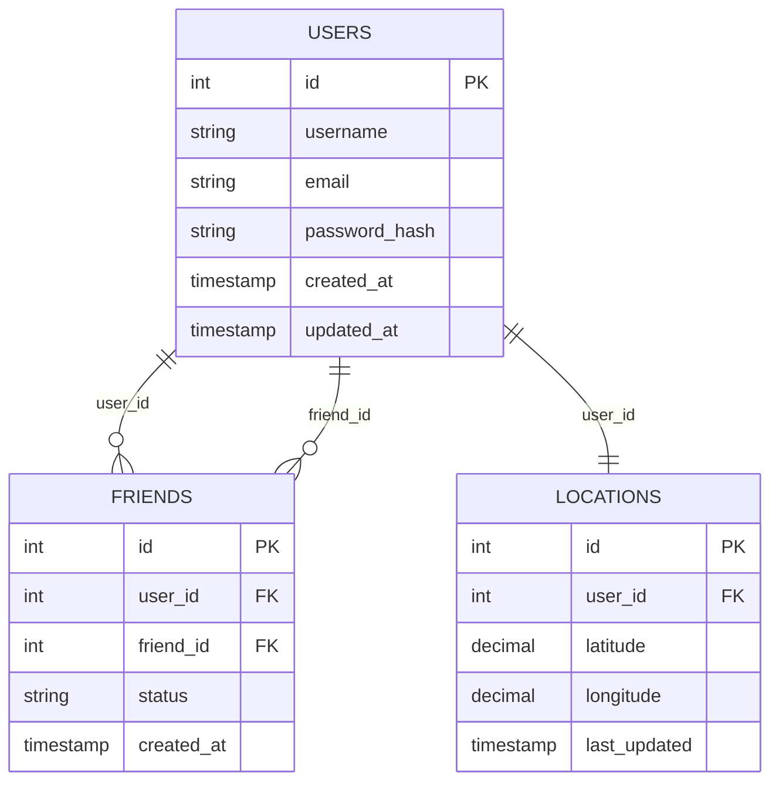

## 13. Service Communication Patterns

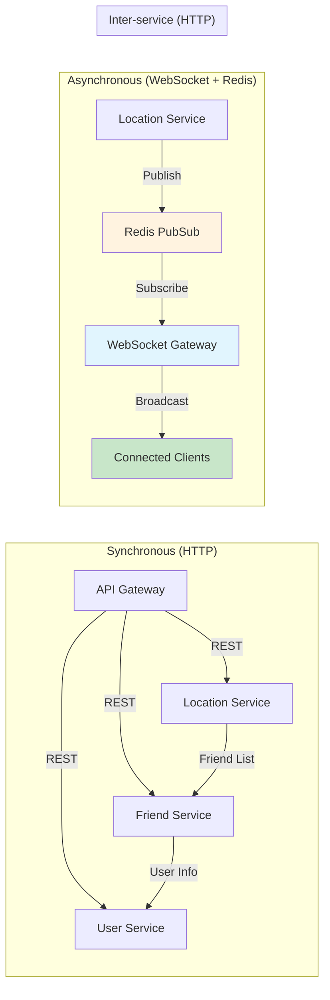

---

## Key Data Flow Characteristics

### 1. **High Availability**
- Multiple service instances can run behind load balancers
- Redis provides session persistence and caching
- PostgreSQL handles transactional data with ACID properties

### 2. **Real-time Performance**
- WebSocket connections for instant notifications
- Redis caching reduces database queries
- Efficient distance calculations with spatial indexing

### 3. **Scalability**
- Microservices can be scaled independently
- Stateless services enable horizontal scaling
- Redis handles high-frequency location updates

### 4. **Data Consistency**
- PostgreSQL ensures transactional integrity
- Redis provides eventual consistency for real-time data
- JWT tokens maintain stateless authentication

This documentation provides a complete view of how data flows through the Nearby Friends system from user interactions to database storage and real-time notifications.