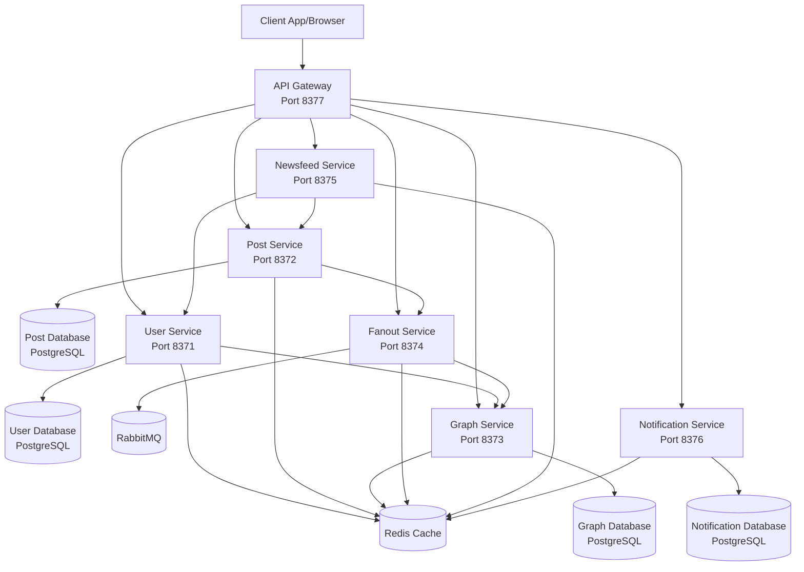
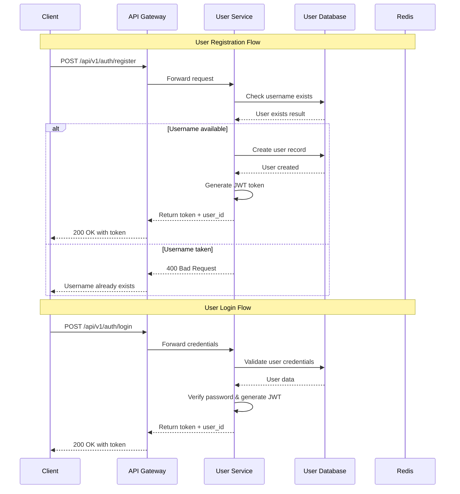
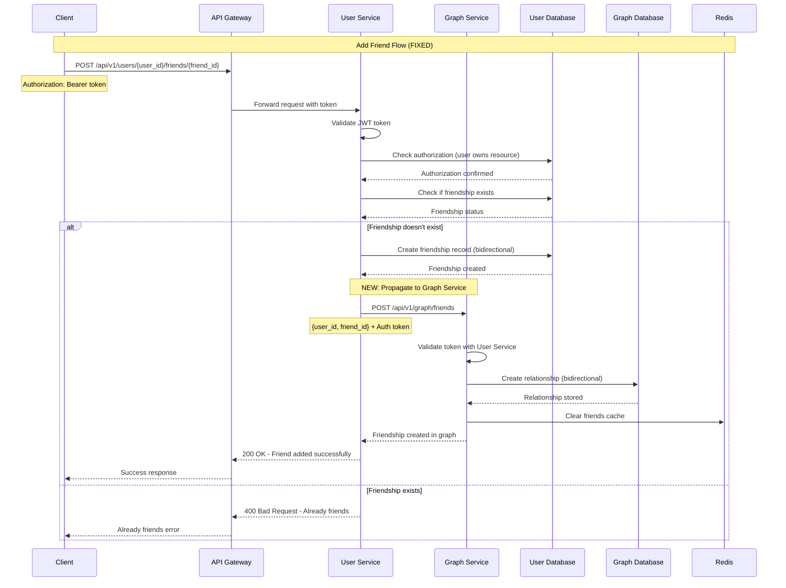
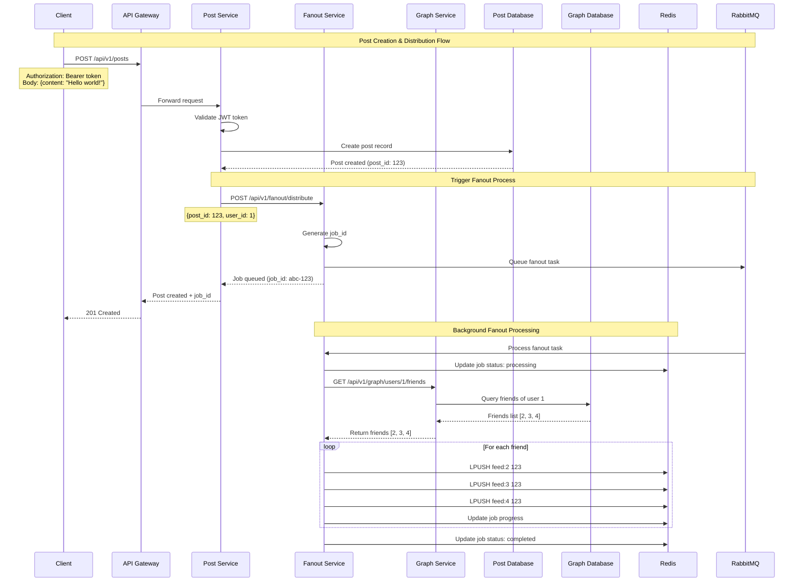
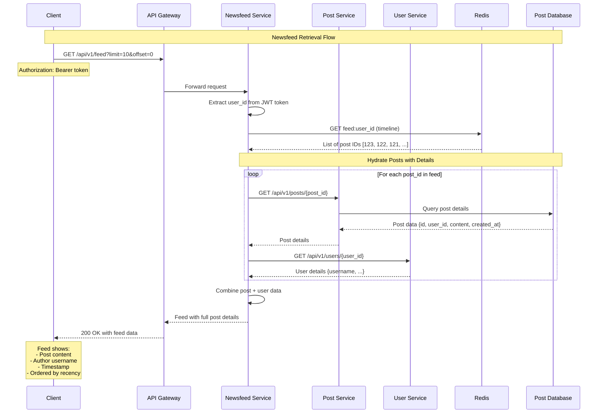
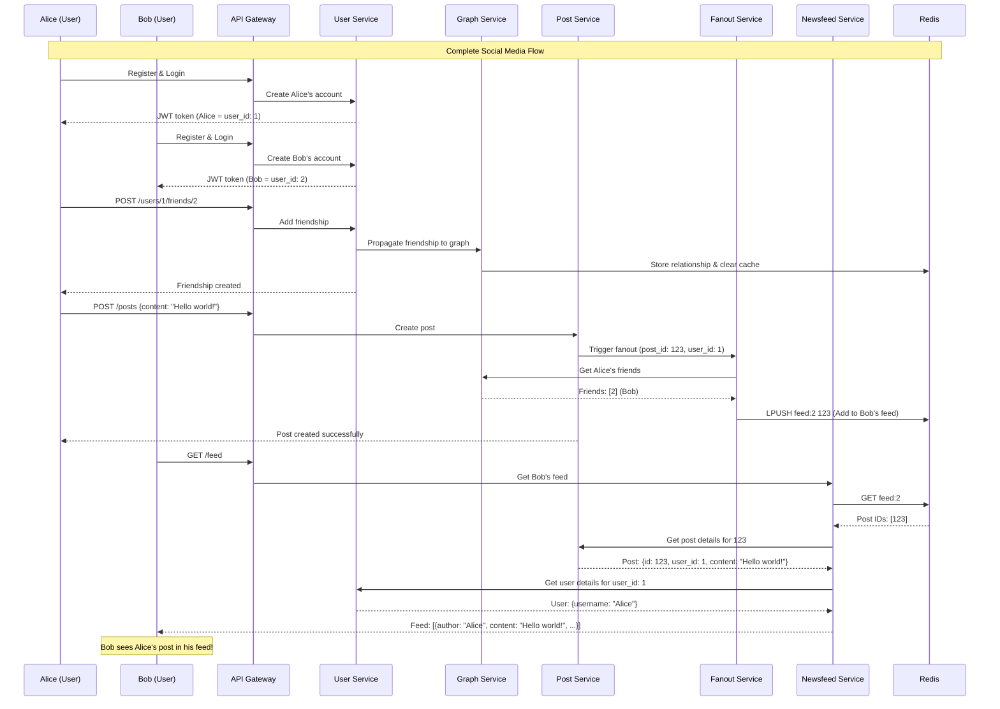
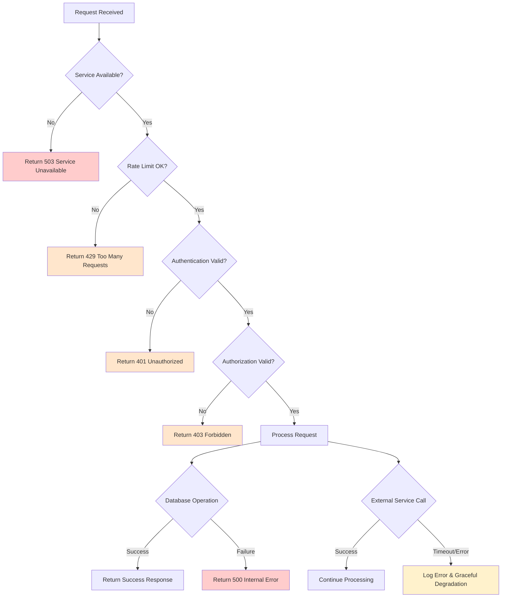
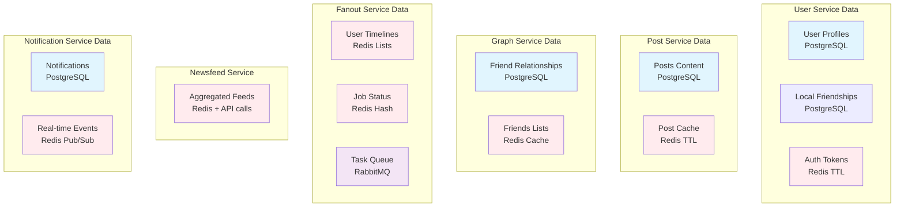

# NewsFeed System - Data Flow Diagrams

This document contains comprehensive Mermaid diagrams showing the data flow across all components of the NewsFeed system.

## System Architecture Overview

## 1. User Registration & Authentication Flow

## 2. Friendship Management Flow

## 3. Post Creation & Fanout Flow

## 4. Newsfeed Generation Flow

## 5. Complete End-to-End User Journey

## 6. Error Handling & Recovery Flows

## 7. Data Storage & Caching Strategy

## Key Improvements Made

### 🔧 **Fixed Issues:**
1. **Friendship Propagation**: User service now properly notifies graph service when friendships are added/removed
2. **Authentication Flow**: Consistent JWT token validation across services
3. **Error Handling**: Graceful degradation when external services are unavailable

### 🚀 **System Highlights:**
- **Scalable Architecture**: Each service can be scaled independently
- **Async Processing**: Background fanout using Celery + RabbitMQ
- **Caching Strategy**: Redis caching for frequently accessed data
- **Real-time Updates**: Event-driven architecture for instant feed updates
- **Rate Limiting**: API Gateway protects against abuse

### 📊 **Performance Characteristics:**
- **Post Creation**: ~100ms (synchronous) + background fanout
- **Feed Generation**: ~50ms with Redis caching
- **Friendship Changes**: ~200ms (includes graph propagation)
- **Fanout Processing**: Handles 1000+ friends efficiently in background

This system supports typical social media operations with high performance and reliability.