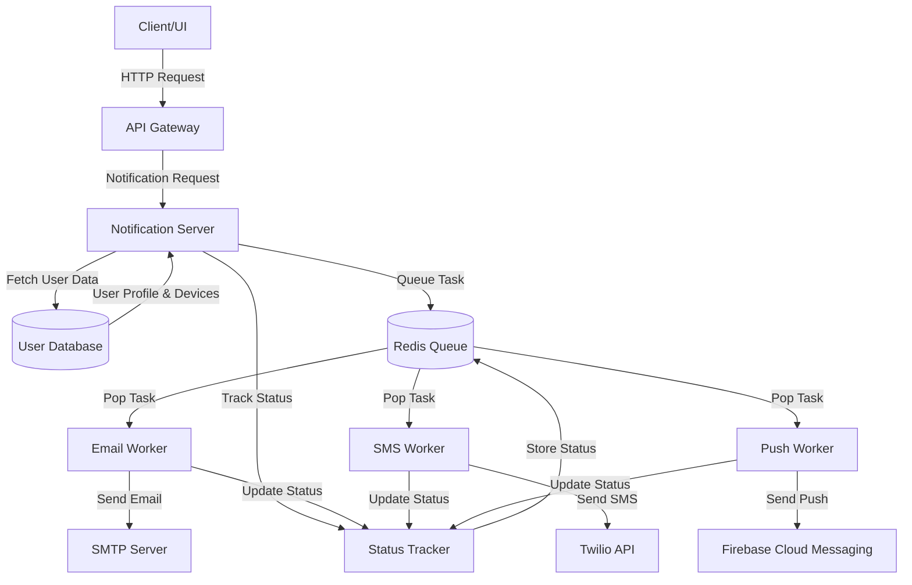
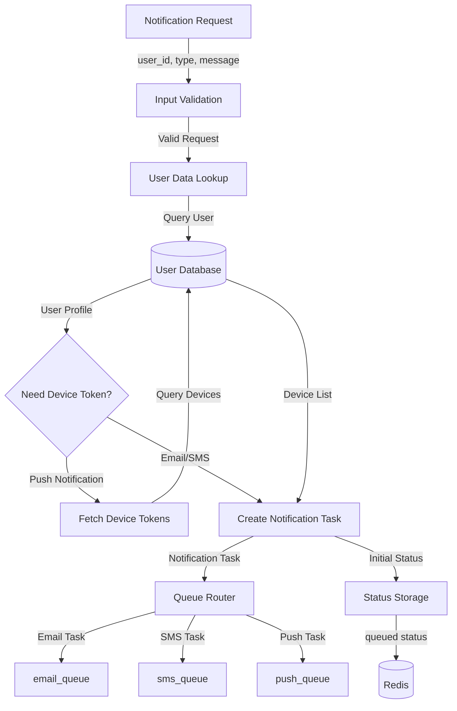
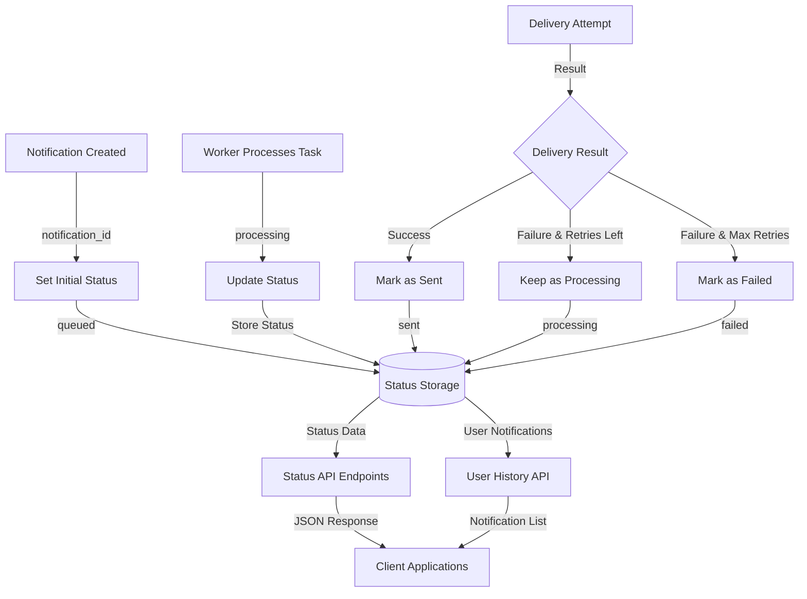
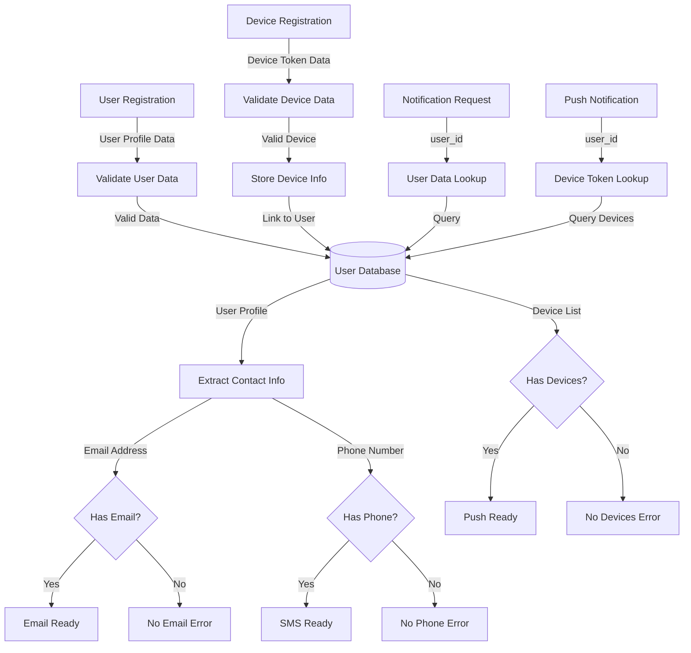
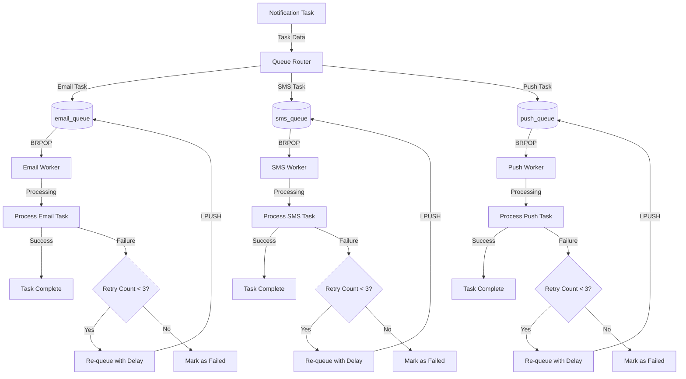
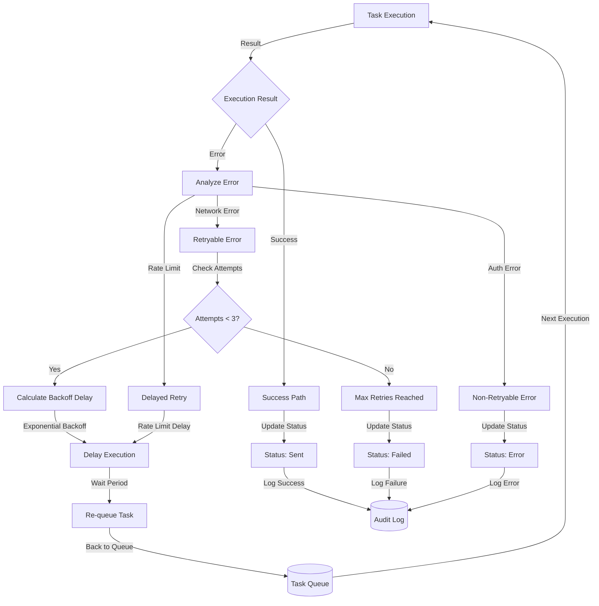
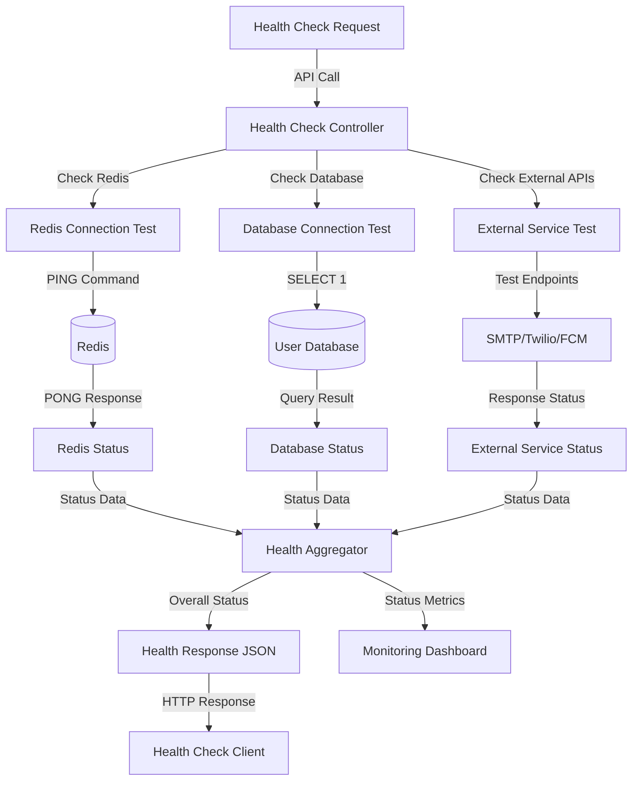

# Notification System - Data Flow Diagrams

This document contains comprehensive data flow diagrams for the notification system using Mermaid diagrams.

## 1. Overall System Data Flow



## 2. Notification Request Processing Data Flow



## 3. Worker Processing Data Flow

```mermaid
flowchart TD
    subgraph "Email Worker Data Flow"
        EmailQueue[email_queue] -->|Pop Task| EmailWorker[Email Worker]
        EmailWorker -->|Parse Task| EmailPayload[Email Payload]
        EmailPayload -->|Extract Data| EmailData[To, Subject, Message]
        EmailData -->|SMTP Request| SMTPServer[SMTP Server]
        SMTPServer -->|Response| RetryLogic[Retry Logic]
        RetryLogic -->|Success| EmailSuccess[Mark as Sent]
        RetryLogic -->|Failure & < 3 attempts| EmailRetry[Retry with Backoff]
        RetryLogic -->|Failure & 3 attempts| EmailFailed[Mark as Failed]
        EmailRetry -->|Re-queue| EmailQueue
    end
    
    subgraph "SMS Worker Data Flow"  
        SMSQueue[sms_queue] -->|Pop Task| SMSWorker[SMS Worker]
        SMSWorker -->|Parse Task| SMSPayload[SMS Payload]
        SMSPayload -->|Extract Data| SMSData[To, Message]
        SMSData -->|API Request| TwilioAPI[Twilio API]
        TwilioAPI -->|Response| SMSRetryLogic[Retry Logic]
        SMSRetryLogic -->|Success| SMSSuccess[Mark as Sent]
        SMSRetryLogic -->|Failure & < 3 attempts| SMSRetry[Retry with Backoff]
        SMSRetryLogic -->|Failure & 3 attempts| SMSFailed[Mark as Failed]
        SMSRetry -->|Re-queue| SMSQueue
    end
    
    subgraph "Push Worker Data Flow"
        PushQueue[push_queue] -->|Pop Task| PushWorker[Push Worker]
        PushWorker -->|Parse Task| PushPayload[Push Payload]
        PushPayload -->|Extract Data| PushData[Device Tokens, Message]
        PushData -->|API Request| FCMAPI[Firebase Cloud Messaging]
        FCMAPI -->|Response| PushRetryLogic[Retry Logic]
        PushRetryLogic -->|Success| PushSuccess[Mark as Sent]
        PushRetryLogic -->|Failure & < 3 attempts| PushRetry[Retry with Backoff]
        PushRetryLogic -->|Failure & 3 attempts| PushFailed[Mark as Failed]
        PushRetry -->|Re-queue| PushQueue
    end
```



## 4. Status Tracking Data Flow



## 5. User Data Management Flow



## 6. Queue Management Data Flow



## 7. Error Handling and Retry Data Flow



## 8. Health Check Data Flow



## Data Models

### Notification Task Structure
```json
{
  "notification_id": "uuid",
  "user_id": "integer", 
  "type": "email|sms|push",
  "payload": {
    "subject": "string (email only)",
    "message": "string",
    "metadata": "object",
    "user_data": {
      "email": "string",
      "phone_number": "string", 
      "devices": "array"
    }
  },
  "created_at": "ISO datetime"
}
```

### Status Tracking Structure
```json
{
  "notification_id": "uuid",
  "user_id": "integer",
  "type": "email|sms|push", 
  "status": "queued|processing|sent|failed",
  "attempts": "integer",
  "created_at": "ISO datetime",
  "updated_at": "ISO datetime",
  "error_message": "string (if failed)"
}
```