# Proximity Service - Data Flow Diagrams

## System Architecture Overview

```mermaid
flowchart TB
    User[👤 User/Client] --> UI[🌐 Demo UI<br/>Port 8081]
    UI --> Gateway[🚪 API Gateway<br/>Port 7891]
    Gateway --> Location[📍 Location Service<br/>Port 8921]
    Gateway --> Business[🏢 Business Service<br/>Port 9823]
    
    Location --> RedisCache[(🗃️ Redis Cache<br/>Geohash Index)]
    Business --> RedisCache
    Location --> PostgresDB[(🐘 PostgreSQL<br/>Business Data)]
    Business --> PostgresDB
    
    Warmer[🔥 Cache Warmer] --> RedisCache
    Warmer --> PostgresDB
    
    subgraph "Database Layer"
        PostgresDB
        PG_Replica1[(🐘 PG Replica 1)]
        PG_Replica2[(🐘 PG Replica 2)]
        PostgresDB --> PG_Replica1
        PostgresDB --> PG_Replica2
    end
    
    subgraph "Cache Layer"
        RedisCache
        Redis_Replica1[(🗃️ Redis Replica 1)]
        Redis_Replica2[(🗃️ Redis Replica 2)]
        RedisCache --> Redis_Replica1
        RedisCache --> Redis_Replica2
    end
```



## 1. Search Nearby Businesses Flow

```mermaid
sequenceDiagram
    participant U as 👤 User
    participant UI as 🌐 UI
    participant GW as 🚪 API Gateway
    participant LS as 📍 Location Service
    participant RC as 🗃️ Redis Cache
    participant BS as 🏢 Business Service
    participant DB as 🐘 PostgreSQL
    
    U->>UI: Enter location & radius
    UI->>GW: GET /api/v1/search/nearby?lat=37.77&lng=-122.41&radius=5000
    GW->>LS: GET /nearby?latitude=37.77&longitude=-122.41&radius=5000
    
    LS->>LS: Calculate geohash precisions (4,5,6)
    LS->>RC: GET geohash:4:9q8y
    LS->>RC: GET geohash:5:9q8yy
    LS->>RC: GET geohash:6:9q8yy4
    RC-->>LS: business_ids: [uuid1, uuid2, uuid3...]
    
    LS->>DB: SELECT * FROM businesses WHERE id IN (uuid1,uuid2...)
    DB-->>LS: Business details with coordinates
    LS->>LS: Calculate distances & filter by radius
    LS-->>GW: {businesses: [{id, distance}...], total: 5}
    GW-->>UI: Search results
    UI->>UI: Display results on map
    UI-->>U: Interactive map with markers
```



## 2. Business Details Flow

```mermaid
sequenceDiagram
    participant U as 👤 User
    participant UI as 🌐 UI
    participant GW as 🚪 API Gateway
    participant BS as 🏢 Business Service
    participant RC as 🗃️ Redis Cache
    participant DB as 🐘 PostgreSQL
    
    U->>UI: Click business marker
    UI->>GW: GET /api/v1/businesses/uuid-123
    GW->>BS: GET /businesses/uuid-123
    
    BS->>RC: GET business:uuid-123
    alt Cache Hit
        RC-->>BS: Full business details
        BS-->>GW: Business data
    else Cache Miss
        BS->>DB: SELECT * FROM businesses WHERE id=uuid-123
        DB-->>BS: Business record
        BS->>RC: SET business:uuid-123 (TTL: 1hr)
        BS-->>GW: Business data
    end
    
    GW-->>UI: Business details JSON
    UI->>UI: Show business popup
    UI-->>U: Business info displayed
```



## 3. Create New Business Flow

```mermaid
sequenceDiagram
    participant U as 👤 User
    participant UI as 🌐 UI
    participant GW as 🚪 API Gateway
    participant BS as 🏢 Business Service
    participant DB as 🐘 PostgreSQL
    participant RC as 🗃️ Redis Cache
    
    U->>UI: Fill business form & submit
    UI->>GW: POST /api/v1/businesses {name, lat, lng, address...}
    GW->>BS: POST /businesses
    
    BS->>DB: INSERT INTO businesses VALUES(...)
    DB-->>BS: New business record with UUID
    
    BS->>RC: SET business:new-uuid (cache individual)
    
    loop For each precision level (4,5,6)
        BS->>BS: Calculate geohash for precision
        BS->>RC: GET geohash:precision:hash
        BS->>BS: Add business_id to list
        BS->>RC: SET geohash:precision:hash [updated_list]
    end
    
    BS-->>GW: Created business response
    GW-->>UI: Success response
    UI->>UI: Add marker to map
    UI-->>U: Business created & visible
```



## 4. Cache Warming Flow

```mermaid
sequenceDiagram
    participant CW as 🔥 Cache Warmer
    participant DB as 🐘 PostgreSQL
    participant RC as 🗃️ Redis Cache
    
    CW->>CW: Start warming process
    CW->>DB: SELECT id, latitude, longitude FROM businesses
    DB-->>CW: All business locations
    
    loop For each business
        loop For each precision (4,5,6)
            CW->>CW: Calculate geohash
            CW->>RC: GET geohash:precision:hash
            CW->>CW: Add business to geohash group
        end
    end
    
    loop For each geohash group
        CW->>RC: SET geohash:precision:hash [business_ids]
    end
    
    CW->>CW: Log completion & sleep
```



## 5. Database Failover Flow

```mermaid
sequenceDiagram
    participant UI as 🌐 UI
    participant BS as 🏢 Business Service
    participant PG_Primary as 🐘 PG Primary
    participant PG_Replica as 🐘 PG Replica
    participant Monitor as 📊 Health Monitor
    
    UI->>Monitor: Simulate DB failure
    Monitor->>PG_Primary: Kill primary database
    
    BS->>PG_Primary: Next DB operation
    PG_Primary-->>BS: Connection failed ❌
    
    BS->>BS: Detect primary failure
    BS->>PG_Replica: Promote replica to primary
    PG_Replica->>PG_Replica: Become new primary
    
    BS->>PG_Replica: Retry operation
    PG_Replica-->>BS: Success ✅
    
    Note over BS,PG_Replica: System continues with new primary
```



## 6. Redis Cache Failover Flow

```mermaid
sequenceDiagram
    participant LS as 📍 Location Service
    participant Redis_Master as 🗃️ Redis Master
    participant Redis_Replica as 🗃️ Redis Replica
    participant Sentinel as 👁️ Redis Sentinel
    
    LS->>Redis_Master: GET geohash data
    Redis_Master-->>LS: Connection failed ❌
    
    LS->>Sentinel: Request current master
    Sentinel->>Redis_Replica: Promote to master
    Redis_Replica->>Redis_Replica: Become new master
    Sentinel-->>LS: New master address
    
    LS->>Redis_Replica: Retry geohash lookup
    Redis_Replica-->>LS: Cache data ✅
    
    Note over LS,Redis_Replica: System continues with new master
```



## 7. Rate Limiting Flow

```mermaid
sequenceDiagram
    participant Client as 👤 Client
    participant GW as 🚪 API Gateway
    participant RC as 🗃️ Redis Cache
    participant Service as 🔧 Backend Service
    
    Client->>GW: API Request
    GW->>GW: Extract client IP
    GW->>RC: INCR rate_limit:client_ip
    
    alt First request in window
        RC-->>GW: count = 1
        GW->>RC: EXPIRE rate_limit:client_ip 60
    else Subsequent requests
        RC-->>GW: count = N
    end
    
    alt count <= 1000 (limit)
        GW->>Service: Forward request
        Service-->>GW: Response
        GW-->>Client: Success response
    else count > 1000
        GW-->>Client: HTTP 429 Rate Limit Exceeded
    end
```



## 8. Health Check Flow

```mermaid
sequenceDiagram
    participant Client as 👤 Client
    participant GW as 🚪 API Gateway
    participant LS as 📍 Location Service
    participant BS as 🏢 Business Service
    participant DB as 🐘 PostgreSQL
    participant RC as 🗃️ Redis Cache
    
    Client->>GW: GET /health
    
    par Check Location Service
        GW->>LS: GET /health
        LS->>DB: SELECT 1 (DB health)
        LS->>RC: PING (Cache health)
        DB-->>LS: OK
        RC-->>LS: PONG
        LS-->>GW: {"status": "healthy"}
    and Check Business Service
        GW->>BS: GET /health
        BS->>DB: SELECT 1
        BS->>RC: PING
        DB-->>BS: OK
        RC-->>BS: PONG
        BS-->>GW: {"status": "healthy"}
    end
    
    GW->>GW: Aggregate health status
    GW-->>Client: {
        "status": "healthy",
        "services": {
            "location": "healthy",
            "business": "healthy"
        }
    }
```

## Key Components Summary

| Component | Port | Purpose |
|-----------|------|---------|
| **Demo UI** | 8081 | Interactive web interface for testing |
| **API Gateway** | 7891 | Request routing, rate limiting, CORS |
| **Location Service** | 8921 | Geospatial search, distance calculations |
| **Business Service** | 9823 | Business CRUD operations, data management |
| **PostgreSQL Primary** | 5832 | Primary database for business data |
| **Redis Master** | 6739 | Geohash cache, business cache, rate limiting |
| **Cache Warmer** | - | Background process for cache preloading |

## Caching Strategy

- **Geohash Cache**: Multi-precision (4,5,6 chars) for different zoom levels
- **Business Cache**: Individual business details (1-hour TTL)
- **Rate Limit Cache**: Per-IP request counting (60-second windows)
- **Cache Invalidation**: Automatic updates when businesses are created/updated

## High Availability Features

- **Database Replication**: Primary + 2 replicas with automatic failover
- **Redis Clustering**: Master + 2 replicas with Sentinel monitoring
- **Service Health Checks**: Real-time monitoring of all components
- **Graceful Degradation**: System continues operating during partial failures