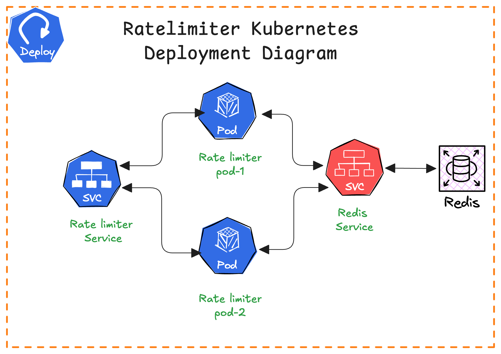

# Rate Limiter Service

A distributed rate limiting service that implements multiple rate limiting algorithms with Redis as the backend storage.

## Features

- Multiple rate limiting algorithms:
  - Fixed Window
  - Sliding Window Counter
  - Sliding Window Log
  - Token Bucket
  - Leaky Bucket
- Distributed rate limiting using Redis
- RESTful API endpoints
- Configurable rate limits and algorithms
- Support for client identification via headers or IP

## Architecture



The diagram above illustrates the high-level architecture of the Rate Limiter service, showing the interaction between different components and the flow of requests through the system.

## Prerequisites

- Python 3.8+
- Redis server
- pip (Python package manager)

## Installation

1. Clone the repository:
```bash
git clone <repository-url>
cd RateLimiter
```

2. Create and activate a virtual environment:
```bash
python3 -m venv venv
source venv/bin/activate  # On Windows: venv\Scripts\activate
```

3. Install dependencies:
```bash
pip install -r requirements.txt
```

## Configuration

The service is configured using `config.yaml`. Example configuration:

```yaml
rate_limiter:
  algorithm: "sliding_window_counter"  # Choose from: fixed_window, sliding_window_counter, sliding_window_log, token_bucket, leaky_bucket
  max_requests: 5
  algorithms:
    fixed_window:
      window_size: 1000  # milliseconds
    sliding_window_counter:
      window_size: 1000
      precision: 100
      cleanup_interval: 1000
      overlap_factor: 2
    sliding_window_log:
      window_size: 1000
      precision: 100
      overlap_factor: 2
    token_bucket:
      refill_rate: 1
    leaky_bucket:
      leak_rate: 1
```

## Running the Service

1. Start Redis server:
```bash
# Using Docker (recommended)
docker run --name my-redis -d -p 6379:6379 redis
```

2. Run the rate limiter service:
```bash
CONFIG_PATH=./config.yaml python app.py
```

The service will start on port 8080 by default.

## API Endpoints

### Rate Limited Endpoint
```
GET /api/limited
```

Headers:
- `X-Client-ID`: Optional client identifier (defaults to IP address)

Response:
```json
{
    "message": "Request processed successfully",
    "remaining": 4,
    "reset_time": 0.5
}
```

## Testing

Run all tests:
```bash
python -m unittest discover -s distributed_ratelimit/tests
```

## Local Kubernetes Deployment

1. Build and run using Docker:
```bash
./build-docker.sh
```

2. Create a local Kubernetes cluster using kind:
```bash
./local/deploy-local.sh
```

3. Configure the rate limiter algorithm in `deployment-local.yaml`:
```yaml
# Inside config.yaml section
rate_limiter:
  algorithm: "sliding_window_log"  # Choose your preferred algorithm
  # ... other configuration ...
```

4. Port forward the service:
```bash
kubectl port-forward service/rate-limiter 8080:8080 -n rate-limiter
```

5. Run algorithm-specific tests:
```bash
# Set the base directory
export HOME=<Base directory where RateLimiter folder is>

# Run specific algorithm test
PYTHONPATH=$PYTHONPATH:. $HOME/RateLimiter/venv/bin/python trigger-data-oroginal-files/test_eks_sliding_window_log.py
```

Available test files for different algorithms:
- `test_eks_sliding_window_log.py`
- `test_eks_sliding_window_counter.py`
- `test_eks_fixed_window.py`
- `test_eks_token_bucket.py`
- `test_eks_leaky_bucket.py`

## Contributing

1. Fork the repository
2. Create a feature branch
3. Commit your changes
4. Push to the branch
5. Create a Pull Request

## License

MIT License

Copyright (c) 2024 [Your Name or Organization]

Permission is hereby granted, free of charge, to any person obtaining a copy
of this software and associated documentation files (the "Software"), to deal
in the Software without restriction, including without limitation the rights
to use, copy, modify, merge, publish, distribute, sublicense, and/or sell
copies of the Software, and to permit persons to whom the Software is
furnished to do so, subject to the following conditions:

The above copyright notice and this permission notice shall be included in all
copies or substantial portions of the Software.

THE SOFTWARE IS PROVIDED "AS IS", WITHOUT WARRANTY OF ANY KIND, EXPRESS OR
IMPLIED, INCLUDING BUT NOT LIMITED TO THE WARRANTIES OF MERCHANTABILITY,
FITNESS FOR A PARTICULAR PURPOSE AND NONINFRINGEMENT. IN NO EVENT SHALL THE
AUTHORS OR COPYRIGHT HOLDERS BE LIABLE FOR ANY CLAIM, DAMAGES OR OTHER
LIABILITY, WHETHER IN AN ACTION OF CONTRACT, TORT OR OTHERWISE, ARISING FROM,
OUT OF OR IN CONNECTION WITH THE SOFTWARE OR THE USE OR OTHER DEALINGS IN THE
SOFTWARE.

## Authors

**Vijayabhaskar V** - [@vijayabhaskarv](https://github.com/hyperscaledesignhub)
Email: thefreedomcodex@gmail.com
Feel free to reach out if you have any questions or suggestions!