# Search Autocomplete System - Complete Data Flow Diagram

## 🎯 System Overview & All Data Flows

```mermaid
graph TB
    %% User Interface
    UI[🌐 Web UI<br/>Port 12847<br/>JavaScript/HTML]
    
    %% API Gateway
    Gateway[🚪 API Gateway<br/>Port 11845<br/>Go/Gin<br/>Rate Limiting & CORS]
    
    %% Core Services
    QuerySvc[🔍 Query Service<br/>Port 12893<br/>Python/FastAPI<br/>Autocomplete Logic]
    
    DataSvc[📊 Data Collection<br/>Port 13761<br/>Python/FastAPI<br/>1% Sampling]
    
    TrieCache[💾 Trie Cache Service<br/>Port 15294<br/>Go<br/>In-Memory Trie]
    
    Analytics[📈 Analytics Aggregator<br/>Port 14742<br/>Python<br/>Batch Processing]
    
    %% Data Storage
    Redis[(🔴 Redis Cache<br/>Port 16379<br/>TTL: 1 hour)]
    
    PostgreSQL[(🐘 PostgreSQL<br/>Port 15432<br/>trie_data<br/>query_frequencies)]
    
    Kafka[(📨 Kafka<br/>Port 19092<br/>search-queries topic)]
    
    %% Flow 1: Autocomplete Query (Read Path)
    UI -->|"1. User types 'react'<br/>150ms debounce"| Gateway
    Gateway -->|"2. GET /v1/autocomplete?q=react<br/>CORS + Rate Limit"| QuerySvc
    QuerySvc -->|"3a. Check cache<br/>Key: autocomplete:react"| Redis
    Redis -->|"3b. Cache HIT<br/>~0.2ms response"| QuerySvc
    QuerySvc -->|"3c. Cache MISS<br/>SQL Query"| PostgreSQL
    PostgreSQL -->|"3d. JSONB data<br/>[{text:'react',freq:12}]"| QuerySvc
    QuerySvc -->|"3e. Cache result<br/>TTL: 1 hour"| Redis
    QuerySvc -->|"4. JSON Response<br/>{suggestions:[...],latency_ms:0.58}"| Gateway
    Gateway -->|"5. CORS headers<br/>+ Response"| UI
    UI -->|"6. Display suggestions<br/>react, react native, etc."| UI
    
    %% Flow 2: Search Logging (Write Path)
    UI -->|"7. User clicks 'react'<br/>Fire-and-forget POST"| Gateway
    Gateway -->|"8. POST /v1/log-search<br/>Rate Limit: 1000/min"| DataSvc
    DataSvc -->|"9a. Sampling decision<br/>1% chance = sampled"| DataSvc
    DataSvc -->|"9b. If sampled<br/>Async send to Kafka"| Kafka
    DataSvc -->|"9c. Response<br/>{status:'accepted',sampled:true/false}"| Gateway
    Gateway -->|"10. Response to UI"| UI
    
    %% Flow 3: Analytics Processing (Background)
    Kafka -->|"11. Consumer reads<br/>search-queries topic"| Analytics
    Analytics -->|"12. Buffer queries<br/>In-memory aggregation"| Analytics
    Analytics -->|"13. Weekly batch OR<br/>/force-aggregation"| Analytics
    Analytics -->|"14a. UPDATE query_frequencies<br/>SET frequency = frequency + 1"| PostgreSQL
    Analytics -->|"14b. Rebuild trie_data<br/>New suggestions with frequencies"| PostgreSQL
    Analytics -->|"14c. Increment version<br/>Cache invalidation"| PostgreSQL
    
    %% Flow 4: Cache Invalidation
    PostgreSQL -->|"15. New trie data<br/>version updated"| Redis
    Redis -->|"16. Cache cleared<br/>Fresh suggestions"| QuerySvc
    
    %% Styling
    classDef uiStyle fill:#e1f5fe,stroke:#0277bd,stroke-width:2px
    classDef serviceStyle fill:#f3e5f5,stroke:#7b1fa2,stroke-width:2px
    classDef storageStyle fill:#e8f5e8,stroke:#2e7d32,stroke-width:2px
    classDef messagingStyle fill:#fff3e0,stroke:#ef6c00,stroke-width:2px
    
    class UI uiStyle
    class Gateway,QuerySvc,DataSvc,TrieCache,Analytics serviceStyle  
    class Redis,PostgreSQL storageStyle
    class Kafka messagingStyle
```

## 🔄 Individual Flow Details

### Flow 1: Autocomplete Query (Read Path - Hot Path)


### Flow 2: Search Logging (Write Path - Analytics)

```mermaid
sequenceDiagram
    participant U as 🌐 User  
    participant UI as 📱 UI
    participant G as 🚪 Gateway
    participant D as 📊 Data Svc
    participant K as 📨 Kafka
    participant A as 📈 Analytics

    U->>UI: Clicks "react" suggestion
    UI->>G: POST /v1/log-search {"query":"react"}
    Note over G: Rate limit: 1000/min
    G->>D: POST /log-query
    
    alt Sampled (1% chance)
        Note over D: Random sampling<br/>1% selected
        D->>K: Produce message to search-queries
        D-->>G: {"status":"accepted","sampled":true}
    else Not Sampled (99% chance)
        Note over D: Query ignored<br/>Reduces load
        D-->>G: {"status":"accepted","sampled":false}  
    end
    
    G-->>UI: Response
    UI-->>U: Search completed
    
    Note over K,A: Background Processing
    K->>A: Consumer reads messages
    Note over A: Buffer queries in memory<br/>Weekly batch processing
```


### Flow 3: Analytics Aggregation (Background Processing)
```mermaid
flowchart TD
    K[📨 Kafka<br/>search-queries topic] --> A[📈 Analytics Aggregator]
    A --> B[📊 In-Memory Buffer<br/>Collect queries]
    B --> C{Weekly Timer<br/>OR<br/>/force-aggregation}
    C -->|Yes| D[🔄 Batch Processing]
    D --> E[📈 Group & Count<br/>query frequencies]
    E --> F[💾 UPDATE query_frequencies<br/>SET frequency = frequency + 1]
    F --> G[🌳 Rebuild trie_data<br/>Generate new suggestions]
    G --> H[📊 UPDATE trie_data<br/>SET suggestions = [...], version++]
    H --> I[🗑️ Clear Redis Cache<br/>Force fresh data]
    I --> J[✅ New suggestions available<br/>for autocomplete]
    
    style K fill:#fff3e0
    style A fill:#f3e5f5  
    style F fill:#e8f5e8
    style H fill:#e8f5e8
    style I fill:#ffebee
```

## 📊 System Architecture & Ports

```mermaid
graph TB
    subgraph "🌐 Frontend Layer"
        UI[Web UI<br/>Port 12847<br/>Native Python]
    end
    
    subgraph "🚪 API Layer" 
        Gateway[API Gateway<br/>Port 11845<br/>Go + Rate Limiting]
    end
    
    subgraph "⚙️ Service Layer"
        QuerySvc[Query Service<br/>Port 12893<br/>Python/FastAPI]
        DataSvc[Data Collection<br/>Port 13761<br/>Python/FastAPI] 
        TrieCache[Trie Cache<br/>Port 15294<br/>Go]
        Analytics[Analytics Aggregator<br/>Port 14742<br/>Python]
    end
    
    subgraph "💾 Data Layer"
        Redis[Redis Cache<br/>Port 16379<br/>TTL: 1 hour]
        PostgreSQL[PostgreSQL<br/>Port 15432<br/>trie_data + query_frequencies]
        Kafka[Kafka<br/>Port 19092<br/>search-queries topic]
    end
    
    UI <--> Gateway
    Gateway <--> QuerySvc
    Gateway <--> DataSvc
    QuerySvc <--> Redis
    QuerySvc <--> PostgreSQL
    DataSvc <--> Kafka
    Kafka <--> Analytics
    Analytics <--> PostgreSQL
```



## 🎯 Key Performance Metrics

| Metric | Value | Description |
|--------|-------|-------------|
| **Cache Hit Response** | ~0.2ms | Redis lookup only |
| **Cache Miss Response** | ~1-2ms | PostgreSQL + Redis cache |
| **UI Debounce** | 150ms | Prevents API spam |
| **Rate Limit - Autocomplete** | 100/min | Per client IP |
| **Rate Limit - Logging** | 1000/min | Per client IP |
| **Sampling Rate** | 1% | Reduces analytics load |
| **Cache TTL** | 1 hour | Redis expiration |
| **Batch Processing** | Weekly | Analytics aggregation |
| **Database Terms** | 96 | Programming vocabulary |
| **Trie Prefixes** | 485 | Autocomplete coverage |

## 🚀 Demo Flow for Presentation

1. **Show User Typing**: Open http://localhost:12847, type "re"
2. **Explain Fast Response**: Point to sub-second suggestions appearing  
3. **Show Network Tab**: Demonstrate API calls to port 11845
4. **Click Suggestion**: Show search logging in action
5. **Backend Logs**: Show Kafka messages and analytics processing
6. **Database Growth**: Demonstrate how popular searches improve autocomplete

This system handles **millions of queries** with intelligent caching and **learns from user behavior** to provide better suggestions over time! 🎯