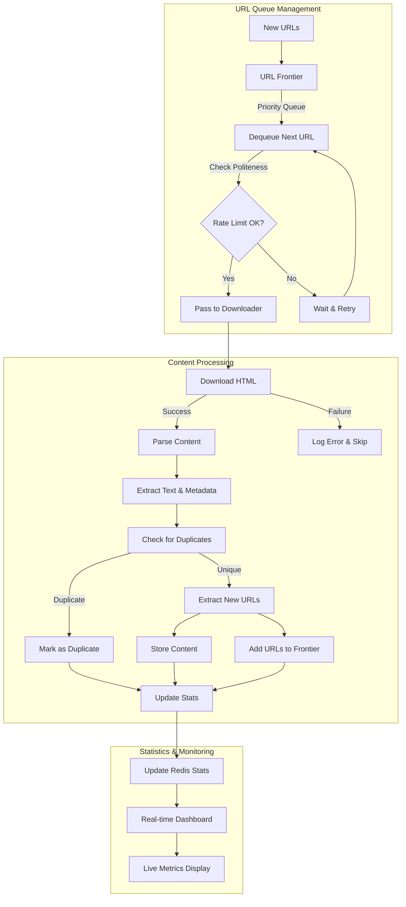

# Web Crawler Data Flow Architecture

## Overview
This document illustrates the data flow through the microservices-based web crawler system, showing how URLs are processed through each service in the pipeline.

## Presentation Guide

### 1. Main Data Flow Pipeline
**Purpose**: Shows the core processing workflow from start to finish.

**Key Points to Explain**:
- **API Gateway** orchestrates the entire process and manages crawl state
- **URL Frontier** maintains a priority queue of URLs to be processed
- **HTML Downloader** fetches web pages from the internet
- **Content Parser** extracts text, metadata, and links from HTML
- **Deduplication** prevents processing the same content twice using content hashing
- **URL Extractor** finds new URLs to add back to the frontier (creates crawling loops)
- **Content Storage** persists processed content with metadata for later retrieval
- **Redis** provides shared state across all stateful services

### 2. Service Interaction Flow
**Purpose**: Shows the complete system architecture with external dependencies.

**Key Points to Explain**:
- **User** interacts through both API Gateway and UI Dashboard
- **External Web** is the data source for the crawler
- **Docker Network** enables service-to-service communication
- **Redis** acts as the central data store for queues and caching
- **File System** provides persistent storage for crawled content
- Services are loosely coupled - each has a single responsibility

### 3. URL Processing Workflow
**Purpose**: Details the step-by-step processing of a single URL.

**Key Points to Explain**:
- **Rate limiting** prevents overwhelming target websites (politeness)
- **Error handling** ensures failed downloads don't stop the entire crawl
- **URL extraction** creates a feedback loop for continuous crawling
- **Statistics tracking** enables real-time monitoring and debugging
- Process is **fault-tolerant** - failures in one URL don't affect others

### 4. Data Types and Flow
**Purpose**: Shows what types of data move between services.

**Key Points to Explain**:
- **Input**: Seed URLs and extracted URLs feed the system
- **Intermediate**: Raw HTML → Parsed Text → Structured Metadata
- **Output**: Statistics for monitoring, Content Index for retrieval, URL Queue for continuation
- **Feedback Loop**: Extracted URLs become new input, enabling recursive crawling
- Data transformations happen at each service boundary

### 5. Service Dependencies
**Purpose**: Illustrates which services depend on shared resources.

**Key Points to Explain**:
- **Independent Services** (Parser, Extractor) can be scaled horizontally easily
- **Stateful Services** depend on Redis for coordination and state management
- **External Dependencies** interact with outside systems (web, filesystem)
- **Redis** is the single point of shared state - critical for system reliability
- Design enables **independent deployment** and **scaling** of services

### 6. Error Handling Flow
**Purpose**: Shows how the system handles failures gracefully.

**Key Points to Explain**:
- **Different error types** require different handling strategies
- **Retry logic** with exponential backoff prevents cascading failures
- **Error statistics** help identify problematic websites or network issues
- **Graceful degradation** - system continues even when individual URLs fail
- **Real-time monitoring** enables quick identification and resolution of issues

### 7. Scaling Considerations
**Purpose**: Shows how the system can grow to handle larger workloads.

**Key Points to Explain**:
- **Horizontal scaling**: Add more instances of stateless services (Downloader, Parser)
- **Vertical scaling**: Increase resources for bottleneck services (Redis memory, Storage disk)
- **Load balancing** distributes work across multiple service instances
- **Bottleneck identification**: Frontier and Gateway are natural scaling constraints
- **Independent scaling**: Each service can be scaled based on its specific resource needs

## Demo Flow Recommendation
1. Start with **Service Interaction Flow** to show the complete system
2. Deep dive into **Main Data Flow Pipeline** to explain the processing steps  
3. Use **URL Processing Workflow** to show a single URL's journey
4. Highlight **Error Handling Flow** to show system resilience
5. Conclude with **Scaling Considerations** to show production readiness

## Main Data Flow Pipeline

```mermaid
flowchart TD
    Start([Start Crawl]) --> Gateway{API Gateway}
    Gateway --> Frontier[📋 URL Frontier]
    
    Frontier --> |Dequeue URLs| Downloader[⬇️ HTML Downloader]
    Downloader --> |HTML Content| Parser[📄 Content Parser]
    Parser --> |Parsed Text & Links| Deduplication{🔍 Deduplication}
    
    Deduplication --> |New Content| Extractor[🔗 URL Extractor]
    Deduplication --> |Duplicate Found| DupLog[📝 Log Duplicate]
    
    Extractor --> |New URLs| Frontier
    Extractor --> |Content + Metadata| Storage[💾 Content Storage]
    
    Storage --> Complete([Processing Complete])
    DupLog --> Complete
    
    %% Redis for persistence
    Redis[(🗄️ Redis)]
    Frontier -.-> Redis
    Deduplication -.-> Redis
    Gateway -.-> Redis
```

## Service Interaction Flow

```mermaid
flowchart LR
    subgraph "External"
        User[👤 User]
        Web[🌐 Web Pages]
    end
    
    subgraph "Core Services"
        Gateway[🌐 API Gateway]
        Frontier[📋 URL Frontier]
        Downloader[⬇️ Downloader]
        Parser[📄 Parser]
        Dedup[🔍 Deduplication]
        Extractor[🔗 Extractor]
        Storage[💾 Storage]
    end
    
    subgraph "Data Layer"
        Redis[(🗄️ Redis)]
        Files[📁 File System]
    end
    
    subgraph "Monitoring"
        Dashboard[🖥️ UI Dashboard]
    end
    
    %% User interactions
    User --> Gateway
    User --> Dashboard
    
    %% Service orchestration
    Gateway --> Frontier
    Gateway --> Downloader
    Gateway --> Parser
    Gateway --> Dedup
    Gateway --> Extractor
    Gateway --> Storage
    
    %% External data
    Downloader --> Web
    
    %% Data persistence
    Frontier -.-> Redis
    Dedup -.-> Redis
    Gateway -.-> Redis
    Storage -.-> Files
    
    %% Monitoring
    Dashboard --> Gateway
```

## URL Processing Workflow

## Data Types and Flow

```mermaid
flowchart TB
    subgraph "Input Data"
        URL1[🔗 Seed URLs]
        URL2[🔗 Extracted URLs]
    end
    
    subgraph "Processing Stages"
        Raw[📄 Raw HTML]
        Parsed[📝 Parsed Text]
        Meta[📊 Metadata]
        Links[🔗 Found Links]
        Content[💾 Stored Content]
    end
    
    subgraph "Output Data"
        Stats[📈 Statistics]
        Index[📋 Content Index]
        Queue[⏳ URL Queue]
    end
    
    URL1 --> Raw
    URL2 --> Raw
    Raw --> Parsed
    Parsed --> Meta
    Parsed --> Links
    Parsed --> Content
    
    Meta --> Stats
    Content --> Index
    Links --> Queue
    Queue --> URL2
```

## Service Dependencies

```mermaid
flowchart TB
    subgraph "Core Dependencies"
        Redis[🗄️ Redis<br/>Shared State]
        Network[🌐 Docker Network<br/>Service Discovery]
    end
    
    subgraph "Independent Services"
        Parser[📄 Parser<br/>Stateless]
        Extractor[🔗 Extractor<br/>Stateless]
    end
    
    subgraph "Stateful Services"
        Frontier[📋 Frontier<br/>Queue State]
        Dedup[🔍 Deduplication<br/>Hash Cache]
        Gateway[🌐 Gateway<br/>Crawl State]
    end
    
    subgraph "External Dependencies"
        Download[⬇️ Downloader<br/>HTTP Requests]
        Storage[💾 Storage<br/>File System]
    end
    
    Redis --> Frontier
    Redis --> Dedup
    Redis --> Gateway
    Network --> Parser
    Network --> Extractor
    Network --> Download
    Network --> Storage
```

## Error Handling Flow

```mermaid
flowchart TD
    Process[Processing URL] --> Check{Success?}
    Check --> |Yes| Success[✅ Continue Pipeline]
    Check --> |No| Error[❌ Error Occurred]
    
    Error --> Type{Error Type}
    Type --> |Network| Retry[🔄 Retry with Backoff]
    Type --> |Parse| Skip[⏭️ Skip & Log]
    Type --> |Storage| Alert[🚨 Alert & Continue]
    
    Retry --> Limit{Max Retries?}
    Limit --> |No| Process
    Limit --> |Yes| Skip
    
    Skip --> Stats[📊 Update Error Stats]
    Alert --> Stats
    Success --> Stats
    
    Stats --> Monitor[📈 Real-time Monitoring]
```

## Scaling Considerations

```mermaid
flowchart LR
    subgraph "Horizontal Scaling"
        LB[⚖️ Load Balancer]
        D1[Downloader 1]
        D2[Downloader 2]
        D3[Downloader N]
        P1[Parser 1]
        P2[Parser 2]
        P3[Parser N]
    end
    
    subgraph "Vertical Scaling"
        Redis[🗄️ Redis<br/>Memory++]
        Storage[💾 Storage<br/>Disk++]
    end
    
    subgraph "Bottlenecks"
        Frontier[📋 Frontier<br/>Single Queue]
        Gateway[🌐 Gateway<br/>Orchestrator]
    end
    
    LB --> D1
    LB --> D2  
    LB --> D3
    
    D1 --> P1
    D2 --> P2
    D3 --> P3
    
    Frontier --> LB
    P1 --> Storage
    P2 --> Storage
    P3 --> Storage
```

